# 介绍

AQS 的全称为 `AbstractQueuedSynchronizer` ，翻译过来的意思就是抽象队列同步器。这个类在 `java.util.concurrent.locks` 包下面。

AQS 就是一个抽象类，主要用来构建锁和同步器，为他们的实现提供了通用功能的实现

## 核心思想

AQS 核心思想是，如果被请求的共享资源空闲，则将当前请求资源的线程设置为有效的工作线程，并且将共享资源设置为锁定状态。如果被请求的共享资源被占用，那么就需要一套线程阻塞等待以及被唤醒时锁分配的机制，这个机制 AQS 是基于 **CLH 锁** （Craig, Landin, and Hagersten locks） 实现的。

CLH 锁是对自旋锁的一种改进，是一个虚拟的双向队列（虚拟的双向队列即不存在队列实例，仅存在结点之间的关联关系），暂时获取不到锁的线程将被加入到该队列中。AQS 将每条请求共享资源的线程封装成一个 CLH 队列锁的一个结点（Node）来实现锁的分配。在 CLH 队列锁中，一个节点表示一个线程，它保存着线程的引用（thread）、 当前节点在队列中的状态（waitStatus）、前驱节点（prev）、后继节点（next）。

# 原理

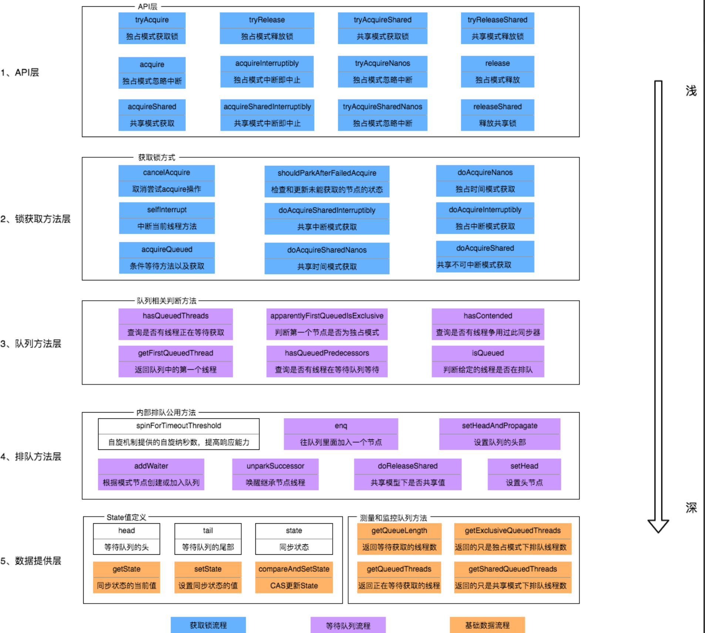

## 同步状态state

```java
// 共享变量，使用volatile修饰保证线程可见性
private volatile int state;

//final表示无法被子类重写
//返回同步状态的当前值
protected final int getState() {
     return state;
}
 // 设置同步状态的值
protected final void setState(int newState) {
     state = newState;
}
//原子地（CAS操作）将同步状态值设置为给定值update如果当前同步状态的值等于expect（期望值）
protected final boolean compareAndSetState(int expect, int update) {
      return unsafe.compareAndSwapInt(this, stateOffset, expect, update);
}
```

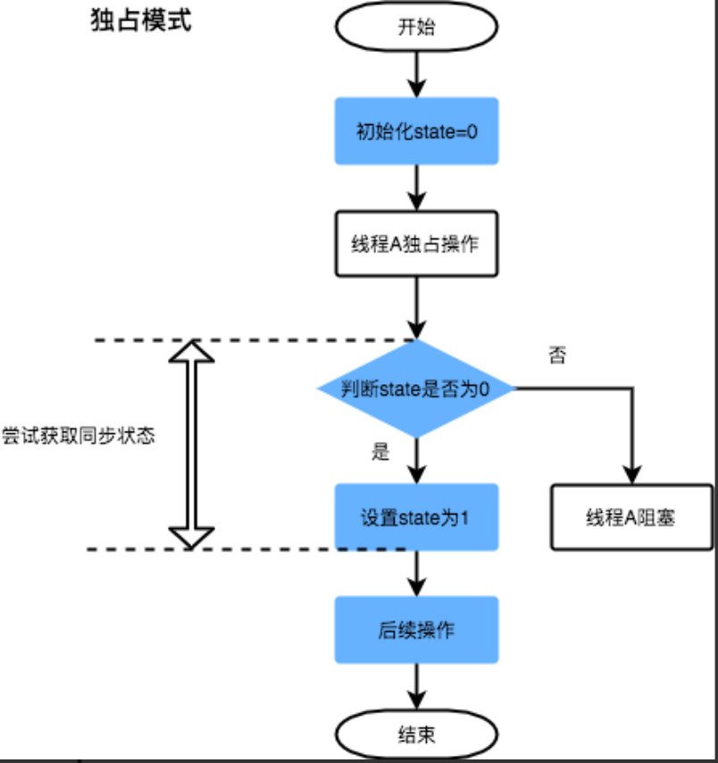

`如reentrantLock`

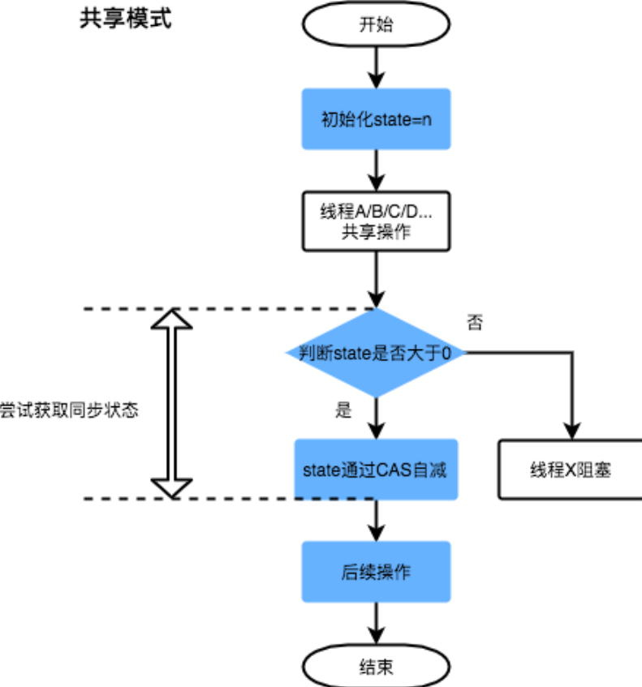

`如同步工具类`

## Node数据结构

解释一下几个方法和属性值的含义：

| 方法和属性值  | 含义                                            |
| :------------ | :---------------------------------------------- |
| waitStatus    | 当前节点在队列中的状态                          |
| thread        | 表示处于该节点的线程                            |
| prev          | 前驱指针                                        |
| predecessor() | 返回前驱节点，没有的话抛出 NullPointerException |
| nextWaiter    | 指向下一个处于 CONDITION 状态的节点             |
| next          | 后继指针                                        |

线程两种锁的模式：

| 模式      | 含义                           |
| :-------- | :----------------------------- |
| SHARED    | 表示线程以共享的模式等待锁     |
| EXCLUSIVE | 表示线程正在以独占的方式等待锁 |

waitStatus 有下面几个枚举值：

| 枚举      | 含义                                             |
| :-------- | :----------------------------------------------- |
| 0         | 当一个 Node 被初始化的时候的默认值               |
| CANCELLED | 为 1，表示线程获取锁的请求已经取消了             |
| CONDITION | 为-2，表示节点在等待队列中，节点线程等待唤醒     |
| PROPAGATE | 为-3，当前线程处在 SHARED 情况下，该字段才会使用 |
| SIGNAL    | 为-1，表示线程已经准备好了，就等资源释放了       |

# 使用

## ReentrantLock

### lock方法

#### 流程

1. CAS 尝试将 state 由 0 改为 1，结果失败

2. 进入 tryAcquire 逻辑，这时 state 已经是1，结果仍然失败

3. 接下来进入 addWaiter 逻辑，构造 Node 队列

  - 图中黄色三角表示该 Node 的 waitStatus 状态，其中 0 为默认正常状态

  - Node 的创建是懒惰的

  - 其中第一个 Node 称为 Dummy（哑元）或哨兵，用来占位，并不关联线程

    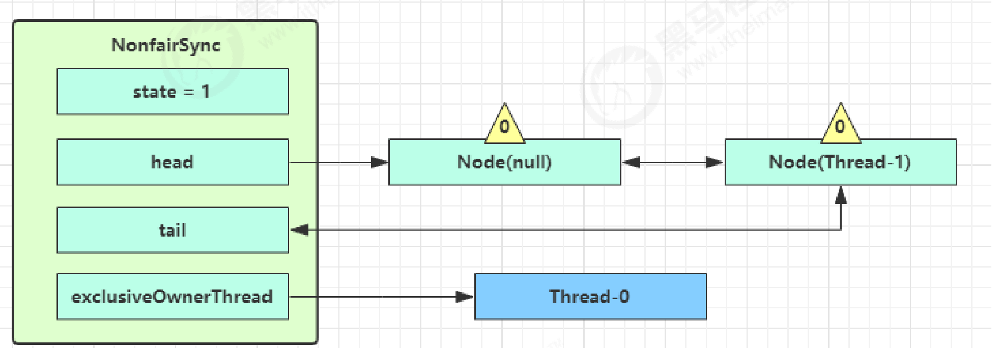

    当前线程进入 acquireQueued 逻辑

    1.acquireQueued 会在一个死循环中不断尝试获得锁，失败后进入 park 阻塞

    2.如果自己是紧邻着 head（排第二位），那么再次 tryAcquire 尝试获取锁，当然这时 state 仍为 1，失败

    3.进入 shouldParkAfterFailedAcquire 逻辑，将前驱 node，即 head 的 waitStatus 改为 -1，这次返回 false

    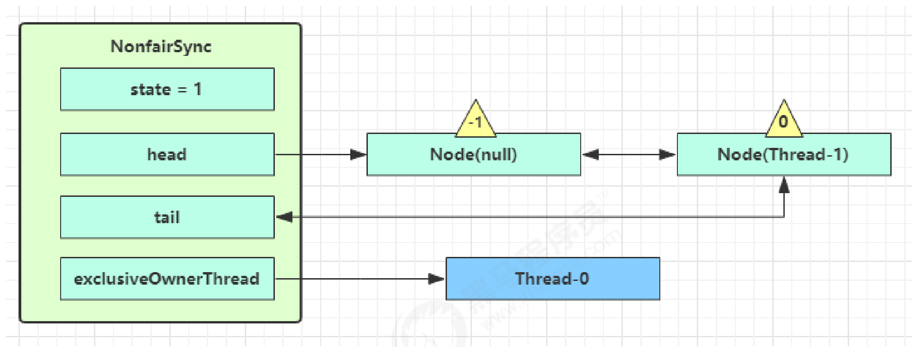

4. shouldParkAfterFailedAcquire 执行完毕回到 acquireQueued ，再次 tryAcquire 尝试获取锁，当然这时
   state 仍为 1，失败

5. 当再次进入 shouldParkAfterFailedAcquire 时，这时因为其前驱 node 的 waitStatus 已经是 -1，这次返回
   true

6. 进入 parkAndCheckInterrupt， Thread-1 park（灰色表示）

  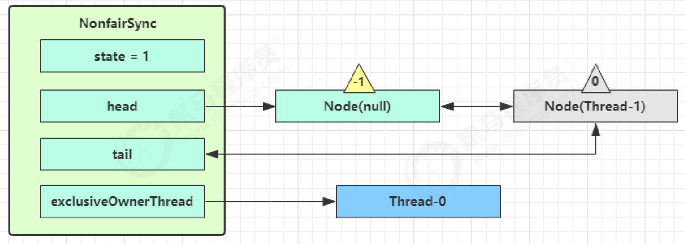

  再次有多个线程经历上述过程竞争失败，变成这个样子

  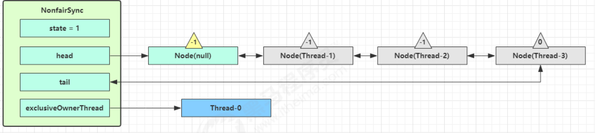

#### 源码

##### 伪代码

###### 非公平锁

```python
def lock():
    if casState成功:
        设置当前线程为独占线程
    else
    	acquire(1)
def acquire(int arg):
    if tryAcquire(arg)失败 && acquireQueued(addWaiter(Node.EXCLUSIVE), arg)成功:
        自己中断
def tryAcquire(int acquires):
    nonfairTryAcquire(acquires)
def nonfairTryAcquire(int acquires):
    if state为0:
        if cas替换state为acquires
            设置当前线程为独占线程
            return true
    
    elif 当前线程为独占线程
        设置State = state + acquires
        return true;
    return false;
def addWaiter(Node mode):
    if tail指针不为null:
        新建节点的prev指针指向之前查询的tail指针(是之前查询的，tail可能在该步骤前就被其他线程修改)
    	if cas tail指针指向创建的node成功:
            之前查询tail指向的节点的next指针指向创建的node            
            return 创建的node;
    enq(创建的节点) ---阻塞队列创建哨兵节点并插入创建的节点
    return 创建的节点;
def enq(final Node node) {
    while true:
        if tail指向null:
	         if 创建一个节点cas 作为head 成功:
                tail = head
        else 
            将实参node的prev指针指向之前查询到的tail
            if CAS将参数node作为tail成功
                之前查询到的tail的next指向node
                return 之前查询到的tail   
#在阻塞队列中再次尝试获取资源    
def acquireQueued(final Node node, int arg):	
	boolean failed = true;
	try :		
		boolean interrupted = false;# 标记等待过程中是否中断过
		# 开始自旋，要么获取锁，要么中断
		while true:
			获取当前节点的前驱节点			
        	 if 前驱节点是head指向的节点 && tryAcquire(arg) :
        		head指向该节点,该节点的thread和prev属性设置为null,前驱节点设置为null,failed=false
        		return interrupted
			
			// 说明p(前驱节点)为头节点且当前没有获取到锁（可能是非公平锁被抢占了）或者是p不为头结点，这个时候就要判断当前node是否要被阻塞（被阻塞条件：前驱节点的waitStatus为-1），防止无限循环浪费资源。具体两个方法下面细细分析
			if (shouldParkAfterFailedAcquire(p, node) //当该node应该被阻塞执行下一个条件即将该线程中断
                && parkAndCheckInterrupt())
				interrupted = true;
		
	 finally:
		if (failed)
			cancelAcquire(node);	
#获取资源失败后是否应该阻塞    
def shouldParkAfterFailedAcquire(Node pred, Node node):
	if 前驱节点状态处于唤醒:
		return true;	
	if 前驱节点处于取消状态:
		do {
			当前节点prev指针和前驱节点指针一起指向之前查询到的前驱节点的prev指向	
		} while (前驱节点处于取消状态)
         做完操作后的前驱节点的next指向当前节点		
	else:
		cas 设置前驱节点状态为唤醒状态
	return false;
#主要用于挂起当前线程，阻塞调用栈，返回当前线程的中断状态
def parkAndCheckInterrupt():
    LockSupport.park(this);
    return Thread.interrupted();  
```

###### 公平锁

```python
def lock():
   acquire(1)
def acquire(int arg):
    if tryAcquire(arg)失败 && acquireQueued(addWaiter(Node.EXCLUSIVE), arg)成功:
        自己中断
def tryAcquire(int acquires):
    final Thread current = Thread.currentThread();
    int c = getState();
    if state为0:
        if (在阻塞队列中没有比该线程等待时间更久的线程 && cas设置state从0到acquires成功) :
            设置当前线程为持有线程
            return true;     
    elif 当前线程为持有线程:
        设置state为state+acquires
        return true;    
    return false;
```


##### ReentrantLock的api层

```java
public void lock() {
    sync.lock();
}
abstract static class Sync extends AbstractQueuedSynchronizer {
    ...
    abstract void lock();//抽象方法,会根据sync的初始化决定是选择那个锁类的lock方法
    ...
}
static final class NonfairSync extends Sync {
	...
	final void lock() {
		if (compareAndSetState(0, 1))
			setExclusiveOwnerThread(Thread.currentThread());//如果成功将该线程作为独占线程
		else
			acquire(1);
		}
  ...
}
static final class FairSync extends Sync {
  ...
	final void lock() {
		acquire(1);
	}
  ...
}

```

##### acquire方法

```java
//不管是哪个锁类的lock方法都有这个方法的影子
//AQS类的方法
public final void acquire(int arg) {
    if (!tryAcquire(arg) &&   //当尝试获取资源失败就会执行下一个判断
        acquireQueued(addWaiter(Node.EXCLUSIVE), arg))
        selfInterrupt();
}


//AQS类中的tryAcquire方法，需要子类去实现
protected boolean tryAcquire(int arg) {
    throw new UnsupportedOperationException();
}
//NonfairSync类实现该方法
protected final boolean tryAcquire(int acquires) {
    return nonfairTryAcquire(acquires);
}
//FairSync类实现该方法
protected final boolean tryAcquire(int acquires) {
    final Thread current = Thread.currentThread();
    int c = getState();
    if (c == 0) { //state为0,资源未被占用
        if (!hasQueuedPredecessors() &&		//查询队列中是否有比该线程等待时间更久的线程---符合公平锁
            compareAndSetState(0, acquires)) {
            setExclusiveOwnerThread(current);
            return true;
        }
    }
    else if (current == getExclusiveOwnerThread()) {//资源被占用但是是被当前线程占用
        //增加state
        int nextc = c + acquires;
        if (nextc < 0)
            throw new Error("Maximum lock count exceeded");
        setState(nextc);
        return true;
    }
    return false; //当资源被其他线程占用
}
//Sync类的不可被重写方法----在非公平锁的tryAcquire方法被调用
final boolean nonfairTryAcquire(int acquires) {
    final Thread current = Thread.currentThread();
    int c = getState();
    if (c == 0) {//state为0,资源未被占用
        if (compareAndSetState(0, acquires)) {//CAS操作成功
            setExclusiveOwnerThread(current);//设置当前线程为资源的ownerThread
            return true;
        }
    }
    else if (current == getExclusiveOwnerThread()) {//资源被占用但是是被当前线程占用
        int nextc = c + acquires;
        if (nextc < 0)
            throw new Error("Maximum lock count exceeded");
        setState(nextc);
        return true;
    }
    return false;//当资源被其他线程占用
}
//AQS类的方法----用于判断队列中是否有比该线程等待时间更久的线程
public final boolean hasQueuedPredecessors() {
    // The correctness of this depends on head being initialized
    // before tail and on head.next being accurate if the current
    // thread is first in queue.
    Node t = tail; // Read fields in reverse initialization order
    Node h = head;
    Node s;
    return h != t && 	//如果该条件不满足，也就是head == tail, 此时队列中不可能有比该线程带得更久的线程，直接返回false
        ((s = h.next) == null || s.thread != Thread.currentThread());//当head!=tail时，根据enq方法可以知道此时加入了一个虚拟头节点，但是h.next==null是因为此时有其他线程进行到tail节点prev指向了head但是没有进行到head的next指向tail(像队列添加节点都是node.prev=tail然后CAS将node变为tail，成功后将上一个tail的next指向node)，所以队列中有节点需要返回true；如果(s = h.next) != null，说明此时队列中至少有一个有效节点。如果此时 s.thread == Thread.currentThread()，说明等待队列的第一个有效节点中的线程与当前线程相同，那么当前线程是可以获取资源的；如果 s.thread != Thread.currentThread()，说明等待队列的第一个有效节点线程与当前线程不同，当前线程必须加入进等待队列。
}


```

##### 队列层方法

`节点加入队列`

```java
//AQS类的方法,将node加入等待队列,在AQS的acquire方法被调用
private Node addWaiter(Node mode) {
    Node node = new Node(Thread.currentThread(), mode);
    Node pred = tail;
    if (pred != null) {
        //将当前节点的prev指针指向之前的tail
        node.prev = pred;
        if (compareAndSetTail(pred, node)) {//CAS成功则将当前节点作为tail并将之前tail节点的next指向node
            pred.next = node;
            return node;
        }
    }
    //之前的tail为null或者CAS失败(在多线程竞争情况下)
    enq(node);
    return node;
}
//AQS类的方法，当tail为null或CAS失败被addWaiter方法调用，可能会执行初始化head与tail，并将node加入队列
private Node enq(final Node node) {
    for (;;) {
        Node t = tail;
        if (t == null) { // 需要初始化
            //初始化一个节点并让head和tail指向该节点-----调用的是Node类的无参构造，所以队列的头节点不指向哪个线程
            if (compareAndSetHead(new Node()))
                tail = head;
        } else {
            //将当前节点的prev指针指向之前的tail
            node.prev = t;
            if (compareAndSetTail(t, node)) {//CAS成功则将当前节点作为tail并将之前tail节点的next指向node
                t.next = node;
                return t;
            }
        }
        //如果初始化完成或CAS失败继续执行死循环直到将该node加入队列
    }
}
```

`队列节点不断尝试获取锁`

```java
//AQS类方法，会把放入队列中的线程不断去获取锁，直到获取成功或者不再需要获取（中断）
final boolean acquireQueued(final Node node, int arg) {
	// 标记是否成功拿到资源
	boolean failed = true;
	try {
		// 标记等待过程中是否中断过
		boolean interrupted = false;
		// 开始自旋，要么获取锁，要么中断
		for (;;) {
			// 获取当前节点的前驱节点
			final Node p = node.predecessor();
			// 如果p是头结点，说明当前节点在真实数据队列的首部，就尝试获取锁（别忘了头结点是虚节点）
			if (p == head && tryAcquire(arg)) {//在阻塞之前如果是head.next的节点，进行CAS4次
                							//第一次在acquire()进行，第二次在tryAcuire()进行，
                							//三四次在这里进行调用tryAcquire()两次
                							//如果不是第一个节点,只会进行前两次CAS操作
				// 获取锁成功，头指针移动到当前node
				setHead(node);
				p.next = null; // help GC
				failed = false;
				return interrupted;
			}        
			// 说明p为头节点且当前没有获取到锁（可能是非公平锁被抢占了）或者是p不为头结点，这个时候就要判断当前node是否要被阻塞（被阻塞条件：前驱节点的waitStatus为-1），防止无限循环浪费资源。具体两个方法下面细细分析
			if (shouldParkAfterFailedAcquire(p, node) //当该node应该被阻塞执行下一个条件即将该线程中断
                && parkAndCheckInterrupt())
				interrupted = true;
		}
	} finally {
		if (failed)
			cancelAcquire(node);
	}
}
//把当前节点置为虚节点
private void setHead(Node node) {
	head = node;
	node.thread = null;
	node.prev = null;
}
// 靠前驱节点判断当前线程是否应该被阻塞
private static boolean shouldParkAfterFailedAcquire(Node pred, Node node) {
	// 获取前驱结点的节点状态
	int ws = pred.waitStatus;
	// 说明前驱结点处于唤醒状态
	if (ws == Node.SIGNAL) //-1
		return true;
	// 通过枚举值我们知道waitStatus>0是取消状态
	if (ws > 0) {
		do {
			// 循环向前查找取消节点，把取消节点从队列中剔除
			node.prev = pred = pred.prev;
		} while (pred.waitStatus > 0);
		pred.next = node;
	} else {
		// 设置前任节点等待状态为SIGNAL
		compareAndSetWaitStatus(pred, ws, Node.SIGNAL);
	}
	return false;
}
//主要用于挂起当前线程，阻塞调用栈，返回当前线程的中断状态
private final boolean parkAndCheckInterrupt() {
    LockSupport.park(this);
    return Thread.interrupted();
}
```

`取消节点`

shouldParkAfterFailedAcquire 中取消节点是怎么生成的呢？什么时候会把一个节点的 waitStatus 设置为-1？
是在什么时间释放节点通知到被挂起的线程呢？

```java
//acquireQueued 方法中的 Finally 代码,通过 cancelAcquire 方法，将 Node 的状态标记为 CANCELLED
private void cancelAcquire(Node node) {
  	// 将无效节点过滤
	if (node == null)
		return;
  	// 设置该节点不关联任何线程，也就是虚节点
	node.thread = null;
	Node pred = node.prev;
  	// 通过前驱节点，跳过取消状态的node
	while (pred.waitStatus > 0)
		node.prev = pred = pred.prev;
  	// 获取过滤后的前驱节点的后继节点
	Node predNext = pred.next;
  	// 把当前node的状态设置为CANCELLED
	node.waitStatus = Node.CANCELLED;
    // 如果当前节点是尾节点，将从后往前的第一个非取消状态的节点设置为尾节点
    // 更新失败的话，则进入else，如果更新成功，将tail的后继节点设置为null
	if (node == tail && compareAndSetTail(node, pred)) {
		compareAndSetNext(pred, predNext, null);
	} else {
		int ws;
    // 如果当前节点不是head的后继节点，1:判断当前节点前驱节点的是否为SIGNAL，2:如果不是，则把前驱节点设置为SINGAL看是否成功
    // 如果1和2中有一个为true，再判断当前节点的线程是否为null
    // 如果上述条件都满足，把当前节点的前驱节点的后继指针指向当前节点的后继节点
		if (pred != head 
            			&& ((ws = pred.waitStatus) == Node.SIGNAL 
                             	|| (ws <= 0 && compareAndSetWaitStatus(pred, ws, Node.SIGNAL))) 
            			&& pred.thread != null) {
			Node next = node.next;
			if (next != null && next.waitStatus <= 0)
				compareAndSetNext(pred, predNext, next);
		} else {
      		// 如果当前节点是head的后继节点，或者上述条件不满足，那就唤醒当前节点的后继节点
			unparkSuccessor(node);
		}
		node.next = node; // help GC
	}
}
```


### unlock方法

#### 流程

Thread-0 释放锁，进入 tryRelease 流程，如果成功

* 设置 exclusiveOwnerThread 为 null

* state = 0

  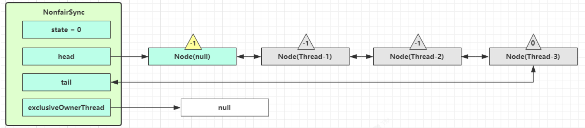

当前队列不为 null，并且 head 的 waitStatus = -1，进入 unparkSuccessor 流程
找到队列中离 head 最近的一个 Node（没取消的），unpark 恢复其运行，本例中即为 Thread-1
回到 Thread-1 的 acquireQueued 流程

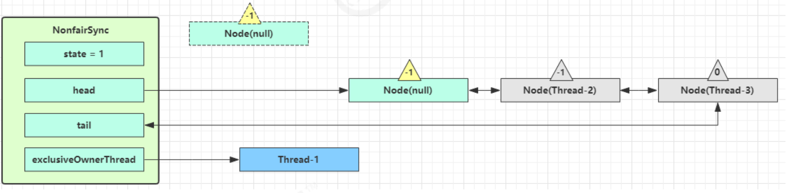

如果加锁成功（没有竞争），会设置

* exclusiveOwnerThread 为 Thread-1，state = 1
* head 指向刚刚 Thread-1 所在的 Node，该 Node 清空 Thread
* 原本的 head 因为从链表断开，而可被垃圾回收

如果这时候有其它线程来竞争（非公平的体现），例如这时有 Thread-4 来了
如果不巧又被 Thread-4 占了先

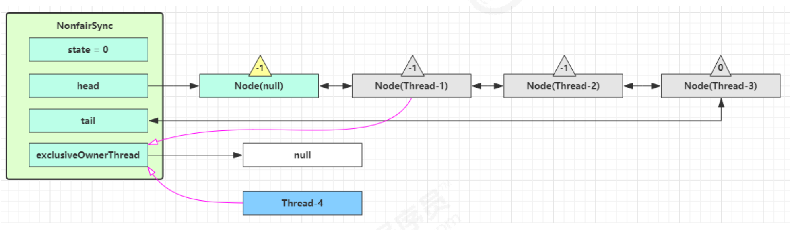

* Thread-4 被设置为 exclusiveOwnerThread，state = 1
* Thread-1 再次进入 acquireQueued 流程，获取锁失败，重新进入 park 阻塞

#### 伪代码

```python
def unlock():
    sync.release(1);

def release(int arg): 	
	if (tryRelease(arg)):		
		if 头节点不为null && 头节点的状态不为0，后继节点可能被阻塞了，需要唤醒 ：          
			unparkSuccessor(h);
		return true;	
	return false;
def tryRelease(int releases):
	if 当前线程不是锁的持有线程
		throw new IllegalMonitorStateException()
	if  state - releases == 0:
		free = true
		设置当前线程为持有线程	
	设置state=state-releases
	return free
def unparkSuccessor(Node node):	
	if 节点状态<0:
		cas设置节点状态为0
	设置被唤醒的节点为node.next
    if 下个节点为null || 下个节点的状态为Cancelled :        
		for (Node t = tail; t != null && t != node; t = t.prev)
			if t的状态不为Cancelled:
				被唤醒的节点设置为t
	if 被唤醒的节点不为null:
         唤醒被唤醒的节点对应的线程
		#当前线程一被unpark就会继续执行acquireQueued方法(tryAcquire中调用的，因为parkAndCheckInterrupt方法被park了)，如果tryAcquire成功就会将该s.waiteSate变为0，然后将s作为head,将node=null方便GC
}
```


#### 源码

```java
public void unlock() {
    sync.release(1);
}

//AQS类
public final boolean release(int arg) {
	// 上边自定义的tryRelease如果返回true，说明该锁没有被任何线程持有
	if (tryRelease(arg)) {
		// 获取头结点
		Node h = head;
		// 头结点不为空并且头结点的waitStatus不是初始化节点情况，解除线程挂起状态
		if (h != null && h.waitStatus != 0)
            //h == null Head 还没初始化。初始情况下，head == null，第一个节点入队，Head 会被初始化一个虚拟节点。所以说，这里如果还没来得及入队，就会出现 head == null 的情况。
            //h != null && waitStatus == 0 表明后继节点对应的线程仍在运行中，不需要唤醒。
            //h != null && waitStatus < 0 表明后继节点可能被阻塞了，需要唤醒。
			unparkSuccessor(h);
		return true;
	}
	return false;
}


//Sync类
// 方法返回当前锁是不是没有被线程持有
protected final boolean tryRelease(int releases) {
	// 减少可重入次数
	int c = getState() - releases;
	// 当前线程不是持有锁的线程，抛出异常
	if (Thread.currentThread() != getExclusiveOwnerThread())
		throw new IllegalMonitorStateException();
	boolean free = false;
	// 如果持有线程全部释放，将当前独占锁所有线程设置为null，并更新state
	if (c == 0) {
		free = true;
		setExclusiveOwnerThread(null);
	}
	setState(c);
	return free;
}

//AQS类的方法
private void unparkSuccessor(Node node) {
	// 获取头结点waitStatus
	int ws = node.waitStatus;
	if (ws < 0)
		compareAndSetWaitStatus(node, ws, 0);
	//找到需要 unpark 的节点, 但本节点从 AQS 队列中脱离, 是由唤醒节点完成的
	Node s = node.next;
	// 如果下个节点是null或者下个节点被cancelled，就找到队列最开始的非cancelled的节点
	if (s == null || s.waitStatus > 0) {
		s = null;
		// 就从尾部节点开始找，到队首，找到队列第一个waitStatus<0的节点。
		for (Node t = tail; t != null && t != node; t = t.prev)
			if (t.waitStatus <= 0)
				s = t;
	}
	// 如果s!=null，而且状态<=0，就把当前s节点unpark
	if (s != null)
		LockSupport.unpark(s.thread);//当前线程一被unpark就会继续执行acquireQueued方法(tryAcquire中调用的，因为parkAndCheckInterrupt方法被park了)，此时头节点的waitStatus为0，可以实现两次tryAcquire().
}
```

### 可重入原理

```java
static final class NonfairSync extends Sync {
    // ...
    // Sync 继承过来的方法, 方便阅读, 放在此处
    final boolean nonfairTryAcquire(int acquires) {
       	...
        // 如果已经获得了锁, 线程还是当前线程, 表示发生了锁重入
        else if (current == getExclusiveOwnerThread()) {
            // state++
            int nextc = c + acquires;
            if (nextc < 0) // overflow
            	throw new Error("Maximum lock count exceeded");
            setState(nextc);
            return true;
        }
    	...
    }
    // Sync 继承过来的方法, 方便阅读, 放在此处
    protected final boolean tryRelease(int releases) {
        // state--
        int c = getState() - releases;
        if (Thread.currentThread() != getExclusiveOwnerThread())
        	throw new IllegalMonitorStateException();
        boolean free = false;
        // 支持锁重入, 只有 state 减为 0, 才释放成功
        if (c == 0) {
            free = true;
            setExclusiveOwnerThread(null);
        }
        setState(c);
        return free;
    }
}
```

### 可打断原理

#### 不可打断模式

在此模式下，即使它被打断，仍会驻留在 AQS 队列中，一直要等到获得锁后方能得知自己被打断了

```java
// Sync 继承自 AQS
static final class NonfairSync extends Sync {
    // ...
    private final boolean parkAndCheckInterrupt() {
        // 如果打断标记已经是 true, 则 park 会失效
        LockSupport.park(this);
        // interrupted 会清除打断标记
        return Thread.interrupted();
    }
    final boolean acquireQueued(final Node node, int arg) {
        boolean failed = true;
        try {
            boolean interrupted = false;
            for (;;) {
                final Node p = node.predecessor();
                if (p == head && tryAcquire(arg)) {
                    setHead(node);
                    p.next = null;
                    failed = false;
                    // 还是需要获得锁后, 才能返回打断状态
                    return interrupted;
                }
                if (
                    shouldParkAfterFailedAcquire(p, node) &&
                    parkAndCheckInterrupt()
                ) {
                    // 这是不可打断模式与可打断模式的区别，不可打断模式是赋值操作，只有当tryAcquire成功才会将该标记返回，而可打断模式则是抛出异常，不用等tryAcquire成功就结束函数
                    interrupted = true;
                }
            }
        } finally {
            if (failed)
                cancelAcquire(node);
        }
    }
    public final void acquire(int arg) {
        if (
            !tryAcquire(arg) &&
            acquireQueued(addWaiter(Node.EXCLUSIVE), arg)
            ) {
                // 如果打断状态为 true
                selfInterrupt();
                }
      }
    static void selfInterrupt() {
        // 重新产生一次中断
        Thread.currentThread().interrupt();
    }
}
```


#### 可打断模式

```java
static final class NonfairSync extends Sync {
    public final void acquireInterruptibly(int arg) throws InterruptedException {
        if (Thread.interrupted())
            throw new InterruptedException();
        // 如果没有获得到锁, 进入 ㈠
        if (!tryAcquire(arg))
            doAcquireInterruptibly(arg);
    }
    
    // ㈠ 可打断的获取锁流程
    private void doAcquireInterruptibly(int arg) throws InterruptedException {
        final Node node = addWaiter(Node.EXCLUSIVE);
        boolean failed = true;
        try {
            for (;;) {
                final Node p = node.predecessor();
                if (p == head && tryAcquire(arg)) {
                    setHead(node);
                    p.next = null; // help GC
                    failed = false;
                    return;
                }
                if (shouldParkAfterFailedAcquire(p, node) &&
                    parkAndCheckInterrupt()) {
                    // 在 park 过程中如果被 interrupt 会进入此
                    // 这时候抛出异常, 而不会再次进入 for (;;)
                    throw new InterruptedException();
                }
            }
        } finally {
            if (failed)
                cancelAcquire(node);
        }
    }
}
```

## Semaphore

### 流程

刚开始，permits（state）为 3，这时 5 个线程来获取资源
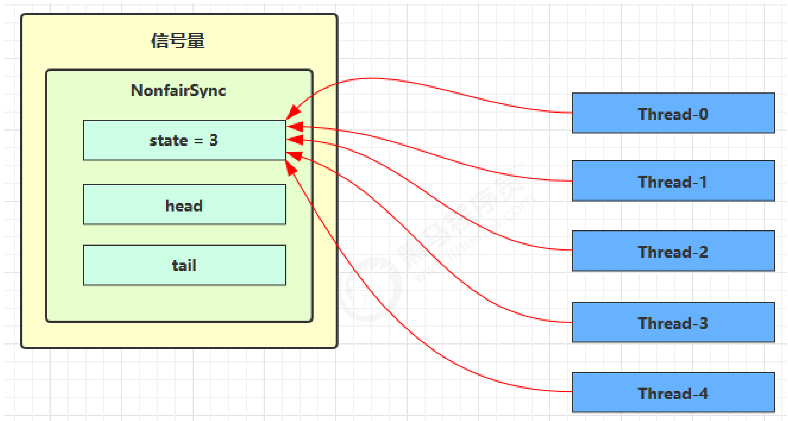
假设其中 Thread-1，Thread-2，Thread-4 cas 竞争成功，而 Thread-0 和 Thread-3 竞争失败，进入 AQS 队列
park 阻塞

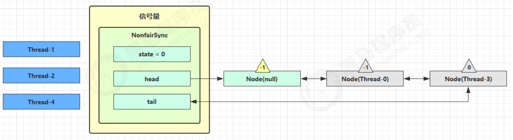这时 Thread-4 释放了 permits，状态如下

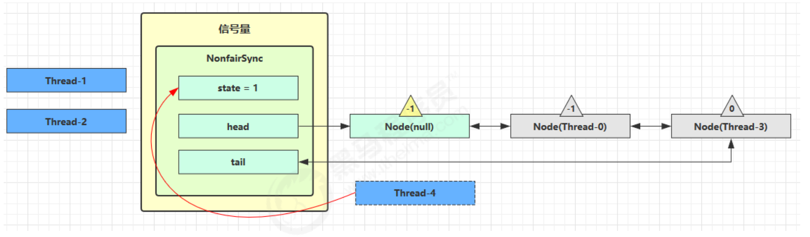接下来 Thread-0 竞争成功，permits 再次设置为 0，设置自己为 head 节点，断开原来的 head 节点，unpark 接
下来的 Thread-3 节点，但由于 permits 是 0，因此 Thread-3 在尝试不成功后再次进入 park 状态

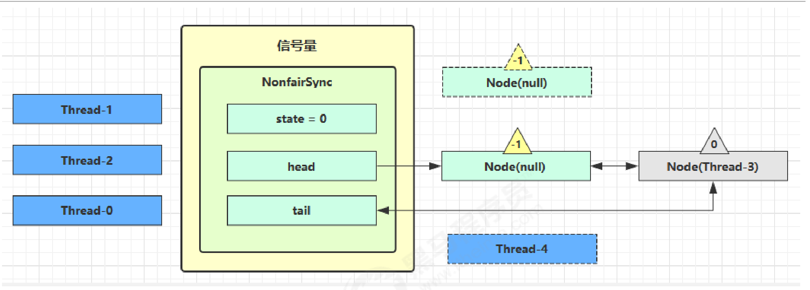

### 源码

#### 构造方法

```java
/*
    构造方法
    */

NonfairSync(int permits) {
    // permits 即 state
    super(permits);
}
//Sync类
Sync(int permits) {
    setState(permits);
}
//AQS类
protected final void setState(int newState) {
    state = newState;
}

```

#### acquire方法

```java
/*
    获取共享资源
    */
    
    // Semaphore 方法, 方便阅读, 放在此处
    public void acquire() throws InterruptedException {
    	sync.acquireSharedInterruptibly(1);
    }
    
    // AQS 继承过来的方法, 方便阅读, 放在此处
    public final void acquireSharedInterruptibly(int arg)
        throws InterruptedException {
        if (Thread.interrupted())
        	throw new InterruptedException();
        if (tryAcquireShared(arg) < 0)	//<0,说明没有共享资源了
        	doAcquireSharedInterruptibly(arg);
    }
    
    //Sync重写AQS
    // 尝试获得共享锁
    protected int tryAcquireShared(int acquires) {
    	return nonfairTryAcquireShared(acquires);
    }
    
	/*
		while true:
			if state - acquires < 0 || cas设置状态成功:
				return state - acquires
	*/
    // Sync的方法, 方便阅读, 放在此处
    final int nonfairTryAcquireShared(int acquires) {
        for (;;) {
            int available = getState();
            int remaining = available - acquires;
            if (
                // 如果许可已经用完, 返回负数, 表示获取失败, 进入 doAcquireSharedInterruptibly
                remaining < 0 ||
                // 如果 cas 重试成功, 返回正数, 表示获取成功
                compareAndSetState(available, remaining)) {
                	return remaining;
                }
        }
    }
    
	/*
		将该节点加入阻塞队列
		boolean failed = true;
         try:
            while true:                
                if 前驱节点为head: 
                	再次尝试获取许可
                     if 尝试成功:                        
                        setHeadAndPropagate(node, r);
                        p.next = null;
                        failed = false;
                        return;                                    
                if (shouldParkAfterFailedAcquire(p, node) &&
                    parkAndCheckInterrupt())
                    throw new InterruptedException();             
         finally:
            if (failed)
            	cancelAcquire(node);        
	
	*/
    // AQS继承过来的方法, 方便阅读, 放在此处
    private void doAcquireSharedInterruptibly(int arg) throws InterruptedException {
        final Node node = addWaiter(Node.SHARED);
        boolean failed = true;
        try {
            for (;;) {
                //获取前驱节点
                final Node p = node.predecessor();
                if (p == head) { //该节点为第二个接待你
                    // 再次尝试获取许可
                    int r = tryAcquireShared(arg);
                    if (r >= 0) {
                        // 成功后本线程出队（AQS）, 所在 Node设置为 head
                        // 如果 head.waitStatus == Node.SIGNAL ==> 0 成功, 下一个节点 unpark
                        // 如果 head.waitStatus == 0 ==> Node.PROPAGATE
                        // r 表示可用资源数, 为 0 则不会继续传播
                        setHeadAndPropagate(node, r);
                        p.next = null; // help GC
                        failed = false;
                        return;
                    }
                 }
                // 不成功, 设置上一个节点 waitStatus = Node.SIGNAL, 下轮进入 park 阻塞
                if (shouldParkAfterFailedAcquire(p, node) &&
                    parkAndCheckInterrupt())
                    throw new InterruptedException(); 
            }
        } finally {
            if (failed)
            	cancelAcquire(node);
        }
    }
    
    
	/*
		if 前驱节点状态为唤醒状态:
			return true;
		if 前驱节点状态为取消状态:
            do {
                当前节点prev指针和前驱节点指针一起指向之前查询到的前驱节点的prev指向	
            } while (前驱节点处于取消状态)
             做完操作后的前驱节点的next指向当前节点
         else:
         	cas设置前驱节点状态为唤醒状态
         return false;
			
	*/
    private static boolean shouldParkAfterFailedAcquire(Node pred, Node node) {
        int ws = pred.waitStatus;
        if (ws == Node.SIGNAL) //-1
            return true;
        if (ws > 0) { //CANCELLED
            do {
                node.prev = pred = pred.prev;
            } while (pred.waitStatus > 0);
            pred.next = node;
        } else {
            compareAndSetWaitStatus(pred, ws, Node.SIGNAL);
        }
        return false;
    }
```

#### release方法

```java

/*
    释放共享资源
    */

// Semaphore 方法, 方便阅读, 放在此处
public void release() {
    sync.releaseShared(1);
}

// AQS 继承过来的方法, 方便阅读, 放在此处
public final boolean releaseShared(int arg) {
    if (tryReleaseShared(arg)) { 
        doReleaseShared(); //在队列中unpark一个线程
        return true;
    }
    return false;
}

// Sync 继承过来的方法, 方便阅读, 放在此处
protected final boolean tryReleaseShared(int releases) {
    for (;;) {
        int current = getState();
        int next = current + releases;
        if (next < current) // overflow
            throw new Error("Maximum permit count exceeded");
        if (compareAndSetState(current, next))
            return true;
    }
}

    /*
		while true:
			if 头节点不为null && 头节点!=尾节点:
				if 头节点状态为唤醒状态:
					if cas设置头节点状态为0失败:
						continue
					唤醒头节点后第一个状态不为Cancelled节点对应的线程
				elif 头节点状态为0 && cas设置头节点状态为传播状态失败:
                	continue
             if 之前获取的头节点现在还是头节点:
             	break
    */
//AQS类的方法
private void doReleaseShared() {
    for (;;) {
        Node h = head;
        if (h != null && h != tail) {	//队列既不是空队列,也不是只有哨兵节点
            int ws = h.waitStatus;
            if (ws == Node.SIGNAL) {
                if (!compareAndSetWaitStatus(h, Node.SIGNAL, 0))
                    continue;            
                unparkSuccessor(h);
            }
            else if (ws == 0 &&
                     !compareAndSetWaitStatus(h, 0, Node.PROPAGATE))
                continue;                
        }
        if (h == head)                   
            break;
    }
}
```

