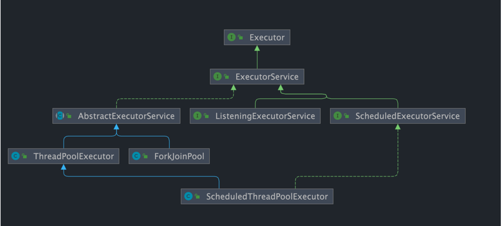
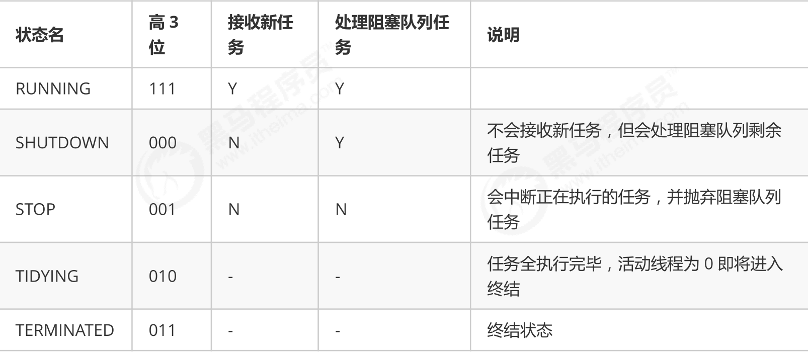

# ThreadPoolExecutor



## 构造方法

```java
/**
     * 用给定的初始参数创建一个新的ThreadPoolExecutor。
     */
public ThreadPoolExecutor(int corePoolSize,//线程池的核心线程数量
                          int maximumPoolSize,//线程池的最大线程数
                          long keepAliveTime,//当线程数大于核心线程数时，多余的空闲线程存活的最长时间
                          TimeUnit unit,//时间单位
                          BlockingQueue<Runnable> workQueue,//任务队列，用来储存等待执行任务的队列
                          ThreadFactory threadFactory,//线程工厂，用来创建线程，一般默认即可
                          RejectedExecutionHandler handler//拒绝策略，当提交的任务过多而不能及时处理时，我们可以定制策略来处理任务
                         ) {
    if (corePoolSize < 0 ||
        maximumPoolSize <= 0 ||
        maximumPoolSize < corePoolSize ||
        keepAliveTime < 0)
        throw new IllegalArgumentException();
    if (workQueue == null || threadFactory == null || handler == null)
        throw new NullPointerException();
    this.corePoolSize = corePoolSize;
    this.maximumPoolSize = maximumPoolSize;
    this.workQueue = workQueue;
    this.keepAliveTime = unit.toNanos(keepAliveTime);
    this.threadFactory = threadFactory;
    this.handler = handler;
}
```

## 拒绝策略

```java
//调用线程执行r
public static class CallerRunsPolicy implements RejectedExecutionHandler {
    
    public CallerRunsPolicy() { }
    
    public void rejectedExecution(Runnable r, ThreadPoolExecutor e) {
        if (!e.isShutdown()) {
            r.run();
        }
    }
}

//抛出 RejectedExecutionException来拒绝新任务的处理。
public static class AbortPolicy implements RejectedExecutionHandler {
    
    public AbortPolicy() { }
    
    public void rejectedExecution(Runnable r, ThreadPoolExecutor e) {
        throw new RejectedExecutionException("Task " + r.toString() +
                                             " rejected from " +
                                             e.toString());
    }
}

//不处理新任务，直接丢弃
public static class DiscardPolicy implements RejectedExecutionHandler {
    
    public DiscardPolicy() { }
   
    public void rejectedExecution(Runnable r, ThreadPoolExecutor e) {
    }
}

//丢弃最早的未处理的任务请求
public static class DiscardOldestPolicy implements RejectedExecutionHandler {
    
    public DiscardOldestPolicy() { }
   
    public void rejectedExecution(Runnable r, ThreadPoolExecutor e) {
        if (!e.isShutdown()) {
            e.getQueue().poll();
            e.execute(r);
        }
    }
}
```

## 创建线程池的两种方法

* 通过七个参数的构造方法构造

* 通过Executors工具类去创建

  ```java
  // 无界队列 LinkedBlockingQueue
  public static ExecutorService newFixedThreadPool(int nThreads) {
  
      return new ThreadPoolExecutor(nThreads, nThreads,0L, TimeUnit.MILLISECONDS,new LinkedBlockingQueue<Runnable>());
  
  }
  
  // 无界队列 LinkedBlockingQueue
  public static ExecutorService newSingleThreadExecutor() {
  
      return new FinalizableDelegatedExecutorService (new ThreadPoolExecutor(1, 1,0L, TimeUnit.MILLISECONDS,new LinkedBlockingQueue<Runnable>()));
  
  }
  
  // 同步队列 SynchronousQueue，没有容量，最大线程数是 Integer.MAX_VALUE`
  public static ExecutorService newCachedThreadPool() {
  
      return new ThreadPoolExecutor(0, Integer.MAX_VALUE,60L, TimeUnit.SECONDS,new SynchronousQueue<Runnable>());
  
  }
  
  // DelayedWorkQueue（延迟阻塞队列）
  public static ScheduledExecutorService newScheduledThreadPool(int corePoolSize) {
      return new ScheduledThreadPoolExecutor(corePoolSize);
  }
  public ScheduledThreadPoolExecutor(int corePoolSize) {
      super(corePoolSize, Integer.MAX_VALUE, 0, NANOSECONDS,
            new DelayedWorkQueue());
  }
  
  ```

  ## 常用阻塞队列

  - 容量为 `Integer.MAX_VALUE` 的 `LinkedBlockingQueue`（无界队列）：`FixedThreadPool` 和 `SingleThreadExector` 。由于队列永远不会被放满，因此`FixedThreadPool`最多只能创建核心线程数的线程。
  - `SynchronousQueue`（同步队列） ：`CachedThreadPool` 。`SynchronousQueue` 没有容量，不存储元素，目的是保证对于提交的任务，如果有空闲线程，则使用空闲线程来处理；否则新建一个线程来处理任务。也就是说，`CachedThreadPool` 的最大线程数是 `Integer.MAX_VALUE` ，可以理解为线程数是可以无限扩展的，可能会创建大量线程，从而导致 OOM。
  - `DelayedWorkQueue`（延迟阻塞队列）：`ScheduledThreadPool` 和 `SingleThreadScheduledExecutor` 。`DelayedWorkQueue` 的内部元素并不是按照放入的时间排序，而是会按照延迟的时间长短对任务进行排序，内部采用的是“堆”的数据结构，可以保证每次出队的任务都是当前队列中执行时间最靠前的。`DelayedWorkQueue` 添加元素满了之后会自动扩容原来容量的 1/2，即永远不会阻塞，最大扩容可达 `Integer.MAX_VALUE`，所以最多只能创建核心线程数的线程。

## 线程池状态

1) 线程池状态
ThreadPoolExecutor 使用 int 的高 3 位来表示线程池状态，低 29 位表示线程数量



从数字上比较，TERMINATED > TIDYING > STOP > SHUTDOWN > RUNNING
这些信息存储在一个原子变量 ctl 中，目的是将线程池状态与线程个数合二为一，这样就可以用一次 cas 原子操作
进行赋值
2) ctl操作

```java
private final AtomicInteger ctl = new AtomicInteger(ctlOf(RUNNING, 0));
private static final int COUNT_BITS = Integer.SIZE - 3;//29
private static final int CAPACITY   = (1 << COUNT_BITS) - 1;
// 3个高位的二进制数表示线程池的状态
private static final int RUNNING    = -1 << COUNT_BITS;// 高3位：111
private static final int SHUTDOWN   =  0 << COUNT_BITS;// 高3位：000
private static final int STOP       =  1 << COUNT_BITS;// 高3位：001
private static final int TIDYING    =  2 << COUNT_BITS;// 高3位：010
private static final int TERMINATED =  3 << COUNT_BITS;// 高3位：011

// ctl拆包方法
private static int runStateOf(int c)     { return c & ~CAPACITY; }
private static int workerCountOf(int c)  { return c & CAPACITY; }
private static int ctlOf(int rs, int wc) { return rs | wc; }
```

## 异步计算结果

**`Future`** 接口以及 `Future` 接口的实现类 **`FutureTask`** 类都可以代表异步计算的结果。

把 **`Runnable`接口** 或 **`Callable` 接口** 的实现类提交给 **`ThreadPoolExecutor`** 或 **`ScheduledThreadPoolExecutor`** 执行。（调用 `submit()` 方法时会返回一个 **`FutureTask`** 对象）

**`Executor` 框架的使用示意图**：


1. 主线程首先要创建实现 `Runnable` 或者 `Callable` 接口的任务对象。
2. 把创建完成的实现 `Runnable`/`Callable`接口的 对象直接交给 `ExecutorService` 执行: ExecutorService.execute（Runnable command）或者也可以把 `Runnable` 对象或`Callable` 对象提交给 `ExecutorService` 执行（`ExecutorService.submit（Runnable task）`或 `ExecutorService.submit（Callable <T> task）`）。
3. 如果执行 `ExecutorService.submit（…）`，`ExecutorService` 将返回一个实现`Future`接口的对象（刚刚也提到过了执行 `execute()`方法和 `submit()`方法的区别，`submit()`会返回一个 `FutureTask 对象）。由于 FutureTask` 实现了 `Runnable`，我们也可以创建 `FutureTask`，然后直接交给 `ExecutorService` 执行。
4. 最后，主线程可以执行 `FutureTask.get()`方法来等待任务执行完成。主线程也可以执行 `FutureTask.cancel（boolean mayInterruptIfRunning）`来取消此任务的执行。


## execute方法

### 伪代码

```python
def execute(Runnable command):
    if command == null :
        抛异常
    if 当前工作线程数 < 核心线程数:
        if addWorker(command,true):
            return;
    if 线程池处于Running状态 && 将command加入队列成功:
        if 再次检查线程池不处于Running状态 && 队列移除command成功:
            reject(command)
        elif 工作线程数量为0:
            addWorker(null,false)
    elif !addWorker(command,false):
        reject(command)
```

### 源码

```java
public void execute(Runnable command) {
    if (command == null)
        throw new NullPointerException();
    //ctl 中保存线程池当前的一些状态信息
    int c = ctl.get();    
    // 如果当前线程数量小于核心线程数量的话，通过addWorker(command, true)新建一个线程，并将任务(command)添加到该线程中；然后，启动该线程从而执行任务。
    if (workerCountOf(c) < corePoolSize) {
        if (addWorker(command, true))
            return;
        c = ctl.get();
    }    
    // 判断线程池是否处于Running状态且将任务加入队列成功
    /*
    如果一个任务可以成功排队，那么我们仍然需要仔细检查是否应该添加一个线程(因为自上次检查以来已有的线程已经死亡)，	或者线程池在进入该方法后关闭。因此，我们重新检查状态，如果停止时如果有必要，回滚队列；或者如果没有工作线程创建		一个线程
    */
    if (isRunning(c) && workQueue.offer(command)) {
        int recheck = ctl.get();
        // 再次获取线程池状态，如果线程池状态不是 RUNNING 状态就需要从任务队列中移除任务，并尝试判断线程是否全部执行完毕。同时执行拒绝策略。
        if (!isRunning(recheck) && remove(command))
            reject(command);
        // 如果当前工作线程数量为0，新创建一个线程并执行。
        else if (workerCountOf(recheck) == 0)
            addWorker(null, false);
    }
    
    //如果线程池不在Running状态或达到阻塞队列最大容量->在保证线程数量未达到创建线程执行任务
    else if (!addWorker(command, false))
        // 如果创建失败，就执行拒绝策略
        reject(command);
}
```

## submit方法

### 伪代码

```python
def submit(参数列表):
    if 任务==null:
        抛异常
    封装为RunnableFuture对象ftask
    execute(ftask)
    return ftask
```

### 源码


```java
public Future<?> submit(Runnable task) {
    if (task == null) throw new NullPointerException();
    RunnableFuture<Void> ftask = newTaskFor(task, null);
    execute(ftask);
    return ftask;
}

public <T> Future<T> submit(Runnable task, T result) {
    if (task == null) throw new NullPointerException();
    RunnableFuture<T> ftask = newTaskFor(task, result);
    execute(ftask);
    return ftask;
}

public <T> Future<T> submit(Callable<T> task) {
    if (task == null) throw new NullPointerException();
    RunnableFuture<T> ftask = newTaskFor(task);
    execute(ftask);
    return ftask;
}

------------------------------------------------------------------
//AbstractExecutorService类    
protected <T> RunnableFuture<T> newTaskFor(Runnable runnable, T value) {
    return new FutureTask<T>(runnable, value);
}

protected <T> RunnableFuture<T> newTaskFor(Callable<T> callable) {
    return new FutureTask<T>(callable);
}    

```

## execute()` vs `submit()

- `execute()`方法用于提交不需要返回值的任务，所以无法判断任务是否被线程池执行成功与否；
- `submit()`方法用于提交需要返回值的任务。线程池会返回一个 `Future` 类型的对象，通过这个 `Future` 对象可以判断任务是否执行成功，并且可以通过 `Future` 的 `get()`方法来获取返回值，`get()`方法会阻塞当前线程直到任务完成，而使用 `get（long timeout，TimeUnit unit）`方法的话，如果在 `timeout` 时间内任务还没有执行完，就会抛出 `java.util.concurrent.TimeoutException`。


## addWorker方法

### 伪代码

```python

```


### 源码

```java
private boolean addWorker(Runnable firstTask, boolean core) {
    // 一个标记, 类似 goto, 自行了解，结合下面的 break 和 continue 就能明白什么意思
    retry:
    // 第一部分
    for (;;) {
        int c = ctl.get();
        // 获取线程池状态
        int rs = runStateOf(c);

        // 返回 false 表示无法接收或处理任务
        // 如果不想返回 false，也就是 if 语句判断不成立，需要满足以下两个条件之一：
        // 1. rs < SHUTDOWN, 也就是 rs == RUNNING（我们之前讲过 RUNNING 表示可以接受新的任务）
        // 2. rs == SHUTDOWN && firstTask == null && ! workQueue.isEmpty()
        // 	2.1 rs == SHUTDOWN 表示不会接收新的任务，但是会执行阻塞队列中的任务
        // 	2.2 firstTask == nul 表示要执行阻塞队列中的任务
        // 	2.3 阻塞队列不能为空
        if (rs >= SHUTDOWN &&
            ! (rs == SHUTDOWN && firstTask == null &&  ! workQueue.isEmpty())
           )

            return false;


        for (;;) {
            // 获取线程池中的线程数量
            int wc = workerCountOf(c);
            // 如果线程数量大于最大容量(CAPACITY), 直接返回 false
            // 如果 core == true ，就判断线程数量是否大于核心线程数
            // 如果 core == false, 就判断线程数量是否大于最大线程数
            if (wc >= CAPACITY ||
                wc >= (core ? corePoolSize : maximumPoolSize))
                return false;

            // 通过 CAS 操作, 把线程池中的线程数量 + 1，然后跳出双层循环，进入第二部分
            if (compareAndIncrementWorkerCount(c))
                break retry;

            // CAS 操作失败，就核对线程池的状态
            c = ctl.get(); 
            if (runStateOf(c) != rs)
                // 继续从最外层循环开始执行
                continue retry;

        }
    }

    // 第二部分
    // 走到这里，表示线程池可以创建新的线程，或者可以执行队列中的任务
    // 两个标记，见名知义
    boolean workerStarted = false;
    boolean workerAdded = false;
    Worker w = null;

    try {
        // 下面两行代码上一篇文章介绍 Worker 对象时，详细说明过
        // 包装需要执行任务（注意 firstTask 可能为 null）
        w = new Worker(firstTask);

        // 获取承载任务的线程
        final Thread t = w.thread;

        if (t != null) {
            // 上锁
            final ReentrantLock mainLock = this.mainLock;
            mainLock.lock();
            try {
                // 再次检查线程池的状态
                int rs = runStateOf(ctl.get());
                // 如果线程池状态为 RUNNING
                // 或者
                // 如果线程池状态为 SHUTDOWN 且 firstTask == null，
                if (rs < SHUTDOWN ||  (rs == SHUTDOWN && firstTask == null)) {
                    if (t.isAlive()) 
                        throw new IllegalThreadStateException();

                    // 添加至 workers 集合
                    workers.add(w);
                    int s = workers.size();
                    if (s > largestPoolSize)
                        largestPoolSize = s;
                    // 添加成功
                    workerAdded = true;
                }
            } finally {
                // 释放锁
                mainLock.unlock();
            }

            // 启动线程
            if (workerAdded) {
                t.start();
                workerStarted = true;
            }
        }
    } finally {
        // 如果线程启动失败, 就删除 workers 集合中刚添加的 Worker 对象
        if (! workerStarted)
            addWorkerFailed(w);
    }

    return workerStarted;
}
```

