# synchronized原理

不管是synchronized是在代码块还是方法上使用，最后都是修饰的一个对象。

锁主要分为偏向锁、轻量级锁、重量级锁，它们判断的依据是根据synchronized修饰对象的MarkWord字段。

当MarkWord字段最后三位为001表示无锁、为101表示偏向锁，当最后两位为00表示轻量级锁、为10表示重量级锁。

当只有一个线程使用这个锁，这是该锁就为偏向锁，对象的MarkWord字段中保存线程信息；

当多个线程使用这把锁，但是他们是交错使用（也就是无竞争）的时候，偏向锁会升级为轻量级锁；

当多个线程竞争使用这把锁，该锁就会升级为重量级锁。

## MarkWord字段

以 32 位虚拟机为例
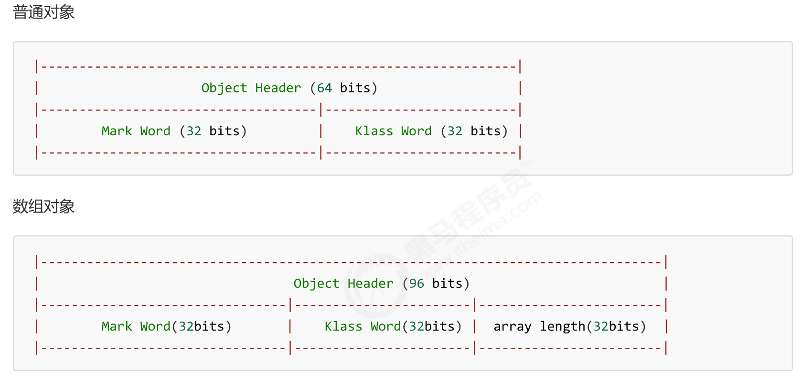

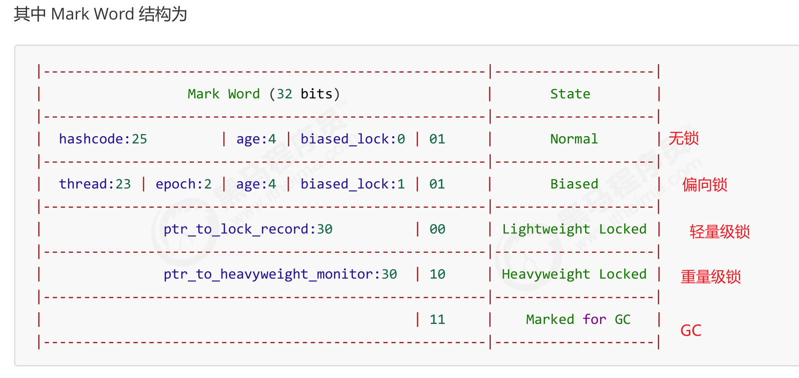

## 轻量级锁使用过程

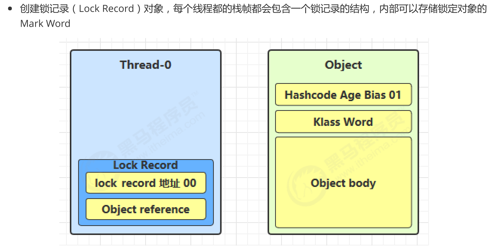

### 加锁过程

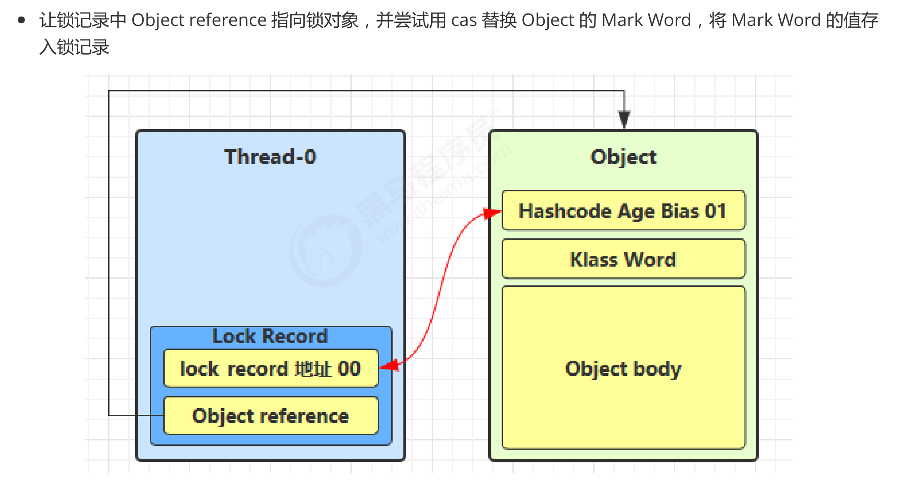

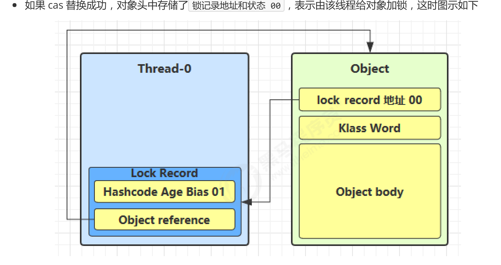

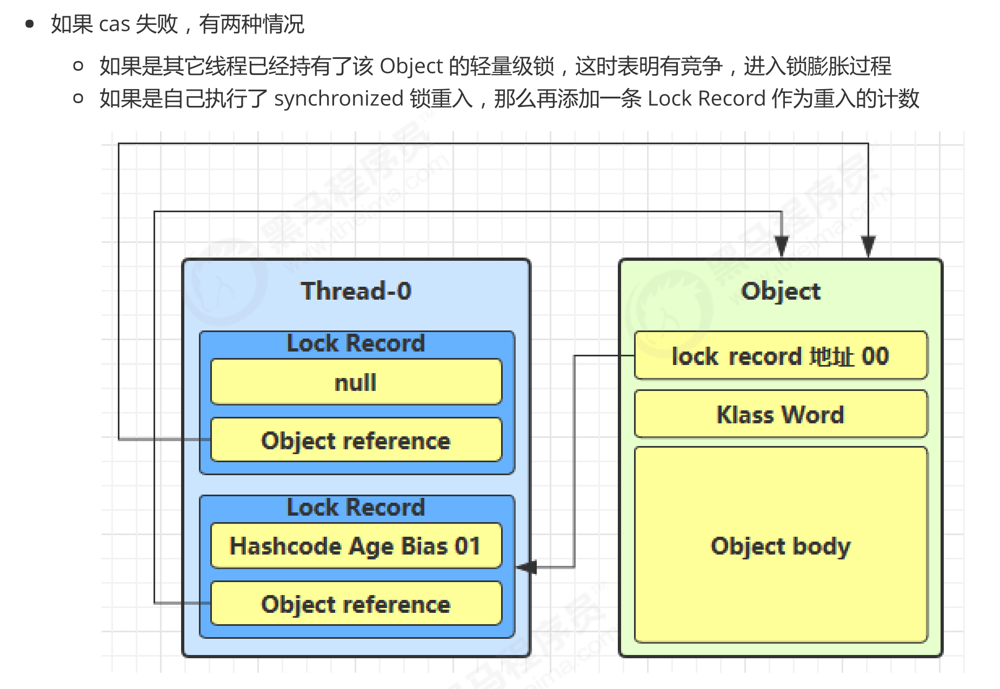

### 解锁过程

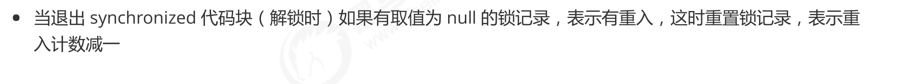

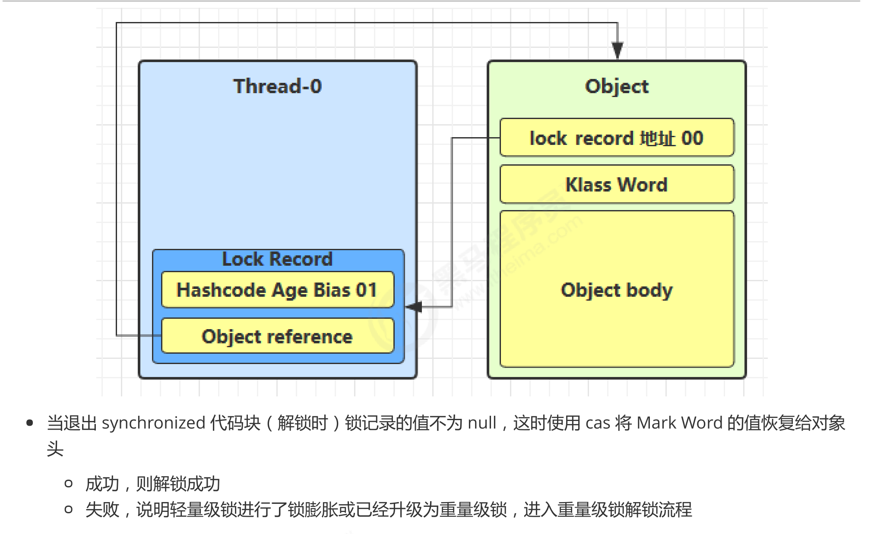

### 锁膨胀

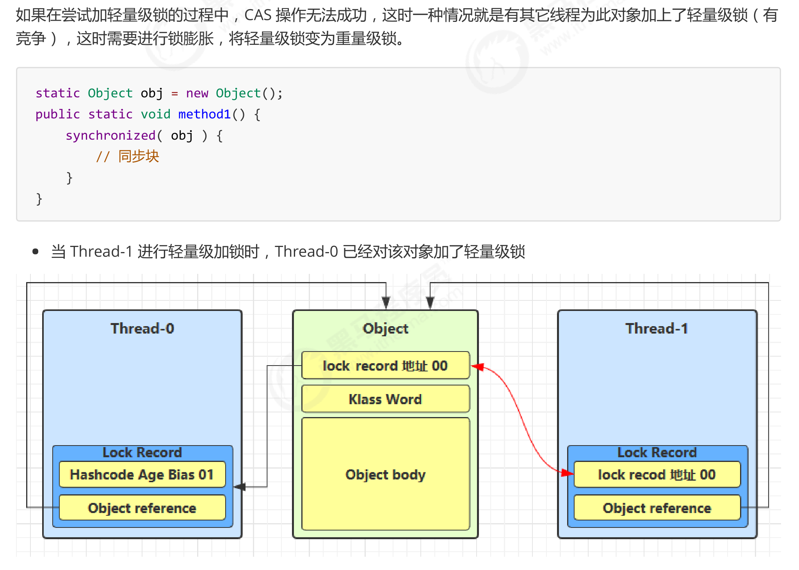

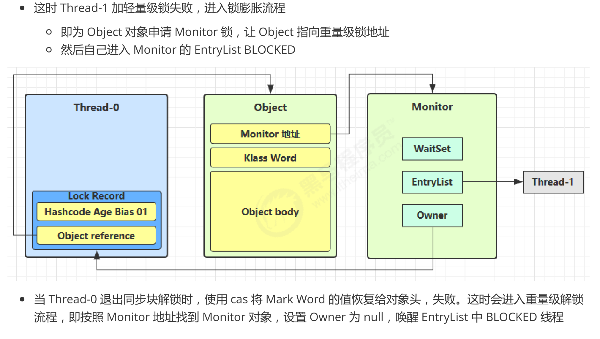

## 重量级锁使用过程

### Monitor

Monitor 被翻译为`监视器`或`管程`

每个 Java 对象都可以关联一个` Monitor `对象，如果使用 synchronized 给对象上锁（重量级）之后，该对象头的
Mark Word 中就被设置指向 Monitor 对象的指针

Monitor 结构如下

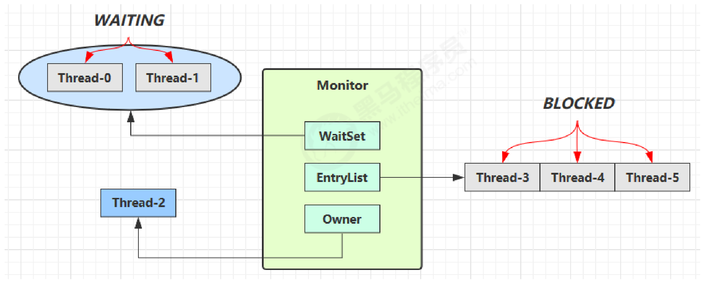

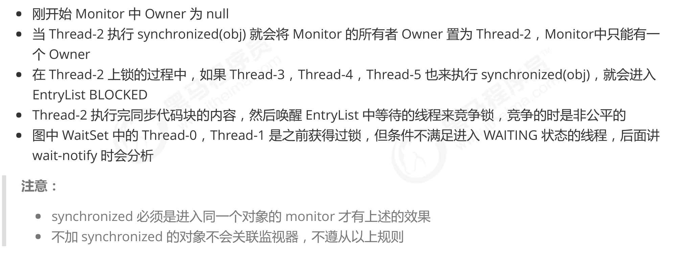