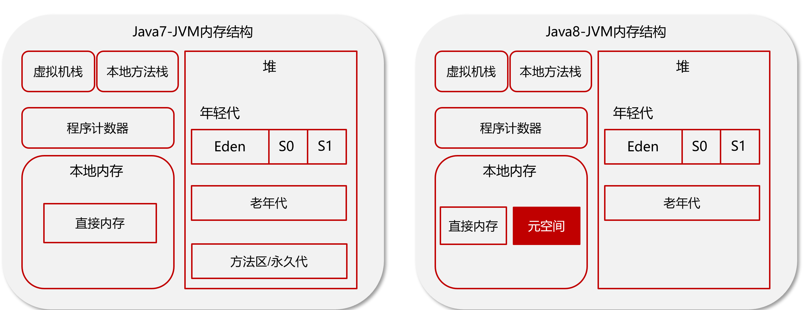

# jvm的组成

## PC

> 什么是程序计数器

线程私有的，每个线程一份，内部保存的字节码的行号。用于记录正在执行的字节码指令的地址。

## 堆

> 详细介绍一下堆

线程共享的区域：主要用来保存对象实例，数组等，内存不够则抛出OutOfMemoryError异常。

组成：年轻代+老年代

* 年轻代被划分为三部分，Eden区和两个大小严格相同的Survivor区

* 老年代主要保存生命周期长的对象，一般是一些老的对象

lJdk1.7和1.8的区别

* 1.7中有有一个永久代，存储的是类信息、静态变量、常量、编译后的代码

* 1.8移除了永久代，把数据存储到了本地内存的元空间中，防止内存溢出

> JDK8的JVM为什么取消了堆中的永久代 / 方法区

JDK 8取消了永久代主要是为了解决永久代的一些问题。永久代是一种特殊的堆区域，用于存储类信息、方法信息、常量池等数据。但是永久代容易导致内存溢出，而且垃圾回收效率低下，特别是在大量使用反射、动态代理等技术的情况下。此外，永久代的大小是固定的，无法动态调整，这也会导致一些问题。

为了解决这些问题，JDK 8引入了元空间（Metaspace）来代替永久代。元空间是存储在本地内存中的一部分。本地内存是由操作系统分配和管理的，它的大小不受Java虚拟机堆大小的限制，因此可以更好地支持动态调整元空间大小的需求。同时，由于本地内存不是Java虚拟机的堆内存，所以可以避免一些与堆内存相关的问题，例如Java虚拟机堆内存溢出等问题。

## 虚拟机栈

> 介绍一下虚拟机栈

* 每个线程运行时所需要的内存，称为虚拟机栈

* 每个栈由多个栈帧（frame）组成，对应着每次方法调用时所占用的内存

* 每个线程只能有一个活动栈帧，对应着当前正在执行的那个方法

> 垃圾回收是否涉及栈内存？

垃圾回收主要指就是堆内存，而在栈中当栈帧弹栈以后，内存就会释放

> 栈内存分配越大越好吗？

默认的栈内存通常为1024k，栈帧过大会导致线程数变少

> 方法内的局部变量是否线程安全？

* 如果方法内局部变量没有逃离方法的作用范围，它是线程安全的

* 如果是局部变量引用了对象，并逃离方法的作用范围，需要考虑线程安全

> 有哪些栈内存溢出情况

* 栈帧过多导致栈内存溢出，典型问题：递归调用

* 栈帧过大导致栈内存溢出

> 堆栈的区别是什么？

* 栈内存一般会用来存储局部变量和方法调用，但堆内存是用来存储Java对象和数组的的。堆会GC垃圾回收，而栈不会。

* 栈内存是线程私有的，而堆内存是线程共有的。

* 两者异常错误不同，但如果栈内存或者堆内存不足都会抛出异常。

  ​        栈空间不足：java.lang.StackOverFlowError。

​			堆空间不足：java.lang.OutOfMemoryError。

## 方法区

> 能不能解释一下方法区？

* 方法区(Method Area)是各个线程共享的内存区域

* 主要存储类的信息、运行时常量池

* 虚拟机启动的时候创建，关闭虚拟机时释放

* 如果方法区域中的内存无法满足分配请求，则会抛出OutOfMemoryError: Metaspace

> 介绍一下常量池

可以看作是一张表，虚拟机指令根据这张常量表找到要执行的类名、方法名、参数类型、字面量等信息。

> 介绍一下运行时常量池

常量池是 *.class 文件中的，当该类被加载，它的常量池信息就会放入运行时常量池，并把里面的符号地址变为真实地址

## 直接内存

> 你听过直接内存吗？

* 并不属于JVM中的内存结构，不由JVM进行管理。是虚拟机的系统内存

* 常见于 NIO 操作时，用于数据缓冲区，分配回收成本较高，但读写性能高，不受 JVM 内存回收管理

示例：

常规IO，多了一次缓冲区复制：

NIO：

# 类加载器

## 介绍

> 什么是类加载器

JVM只会运行二进制文件，类加载器的作用就是将字节码文件加载到JVM中，从而让Java程序能够启动起来。

> 类加载器有哪些

## 类加载器加载过程

类从加载到虚拟机中开始，直到卸载为止，它的整个生命周期包括了：加载、验证、准备、解析、初始化、使用和卸载这7个阶段。其中，验证、准备和解析这三个部分统称为连接（linking）

### 加载

* 通过类的全名，获取类的二进制数据流。

* 解析类的二进制数据流到方法区内的数据结构（Java类模型） 

* 创建java.lang.Class类的实例，表示该类型。作为方法区这个类的各种数据的访问入口

### 验证

验证类是否符合 JVM规范，安全性检查

### 准备

**为类变量分配内存并设置类变量初始值**

### 解析

**把类中的符号引用转换为直接引用**，比如：方法中调用了其他方法，方法名可以理解为符号引用，而直接引用就是使用指针直接指向方法。

从

到

### 初始化

**对类的静态变量，静态代码块执行初始化操作**

* 如果初始化一个类的时候，其父类尚未初始化，则优先初始化其父类。

* 如果同时包含多个静态变量和静态代码块，则按照自上而下的顺序依次执行。

* 当只使用父类的静态变量就会只初始化父类的静态代码块，而不会初始化子类的静态代码块。

### 使用

JVM 开始从入口方法开始执行用户的程序代码

* 调用静态类成员信息（比如：静态字段、静态方法）

* 使用new关键字为其创建对象实例

### 总结

* 加载:查找和导入class文件

* 验证:保证加载类的准确性

* 准备:为类变量分配内存并设置类变量初始值

*  解析:把类中的符号引用转换为直接引用

* 初始化:对类的静态变量，静态代码块执行初始化操作

* 使用:JVM 开始从入口方法开始执行用户的程序代码

* 卸载:当用户程序代码执行完毕后，JVM便开始销毁创建的Class对象。

## 双亲委派机制

> 什么是双亲委派模型？

加载某一个类，先委托上一级的加载器进行加载，如果上级加载器也有上级，则会继续向上委托，如果该类委托上级没有被加载，子加载器尝试加载该类

> JVM为什么采用双亲委派机制？

* 通过双亲委派机制可以避免某一个类被重复加载，当父类已经加载后则无需重复加载，保证唯一性。

* 为了安全，保证类库API不会被修改

# 垃圾回收

