# jvm的组成

## PC

> 什么是程序计数器

线程私有的，每个线程一份，内部保存的字节码的行号。用于记录正在执行的字节码指令的地址。

## 堆

> 详细介绍一下堆

线程共享的区域：主要用来保存对象实例，数组等，内存不够则抛出OutOfMemoryError异常。

组成：年轻代+老年代

* 年轻代被划分为三部分，Eden区和两个大小严格相同的Survivor区

* 老年代主要保存生命周期长的对象，一般是一些老的对象

lJdk1.7和1.8的区别

* 1.7中有有一个永久代，存储的是类信息、静态变量、常量、编译后的代码

* 1.8移除了永久代，把数据存储到了本地内存的元空间中，防止内存溢出

> JDK8的JVM为什么取消了堆中的永久代 / 方法区

JDK 8取消了永久代主要是为了解决永久代的一些问题。永久代是一种特殊的堆区域，用于存储类信息、方法信息、常量池等数据。但是永久代容易导致内存溢出，而且垃圾回收效率低下，特别是在大量使用反射、动态代理等技术的情况下。此外，永久代的大小是固定的，无法动态调整，这也会导致一些问题。

为了解决这些问题，JDK 8引入了元空间（Metaspace）来代替永久代。元空间是存储在本地内存中的一部分。本地内存是由操作系统分配和管理的，它的大小不受Java虚拟机堆大小的限制，因此可以更好地支持动态调整元空间大小的需求。同时，由于本地内存不是Java虚拟机的堆内存，所以可以避免一些与堆内存相关的问题，例如Java虚拟机堆内存溢出等问题。

## 虚拟机栈

> 介绍一下虚拟机栈

* 每个线程运行时所需要的内存，称为虚拟机栈

* 每个栈由多个栈帧（frame）组成，对应着每次方法调用时所占用的内存

* 每个线程只能有一个活动栈帧，对应着当前正在执行的那个方法

> 垃圾回收是否涉及栈内存？

垃圾回收主要指就是堆内存，而在栈中当栈帧弹栈以后，内存就会释放

> 栈内存分配越大越好吗？

默认的栈内存通常为1024k，栈帧过大会导致线程数变少

> 方法内的局部变量是否线程安全？

* 如果方法内局部变量没有逃离方法的作用范围，它是线程安全的

* 如果是局部变量引用了对象，并逃离方法的作用范围，需要考虑线程安全

> 有哪些栈内存溢出情况

* 栈帧过多导致栈内存溢出，典型问题：递归调用

* 栈帧过大导致栈内存溢出

> 堆栈的区别是什么？

* 栈内存一般会用来存储局部变量和方法调用，但堆内存是用来存储Java对象和数组的的。堆会GC垃圾回收，而栈不会。

* 栈内存是线程私有的，而堆内存是线程共有的。

* 两者异常错误不同，但如果栈内存或者堆内存不足都会抛出异常。

  ​        栈空间不足：java.lang.StackOverFlowError。

​			堆空间不足：java.lang.OutOfMemoryError。

> 栈可能出现的错误

**`StackOverFlowError`：** 若栈的内存大小不允许动态扩展，那么当线程请求栈的深度超过当前 Java 虚拟机栈的最大深度的时候，就抛出 `StackOverFlowError` 错误。

**`OutOfMemoryError`：** 如果栈的内存大小可以动态扩展， 如果虚拟机在动态扩展栈时无法申请到足够的内存空间，则抛出`OutOfMemoryError`异常。

## 方法区

> 能不能解释一下方法区？

* 方法区(Method Area)是各个线程共享的内存区域

* 主要存储类的信息、运行时常量池

* 虚拟机启动的时候创建，关闭虚拟机时释放

* 如果方法区域中的内存无法满足分配请求，则会抛出OutOfMemoryError: Metaspace

> 介绍一下常量池

可以看作是一张表，虚拟机指令根据这张常量表找到要执行的类名、方法名、参数类型、字面量等信息。

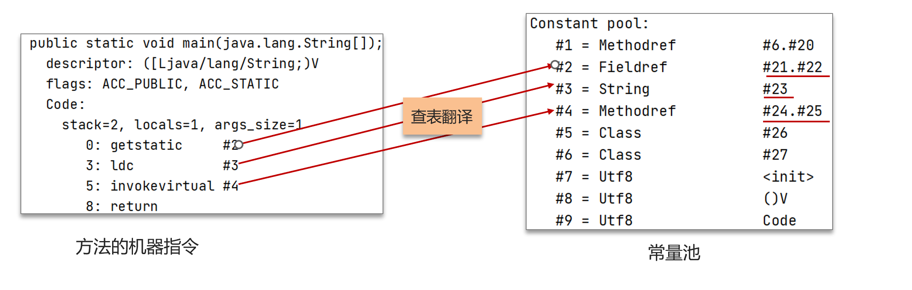

> 介绍一下运行时常量池

常量池是 *.class 文件中的，当该类被加载，它的常量池信息就会放入运行时常量池，并把里面的符号地址变为真实地址

## 直接内存

> 你听过直接内存吗？

* 并不属于JVM中的内存结构，不由JVM进行管理。是虚拟机的系统内存

* 常见于 NIO 操作时，用于数据缓冲区，分配回收成本较高，但读写性能高，不受 JVM 内存回收管理

示例：

常规IO，多了一次缓冲区复制：

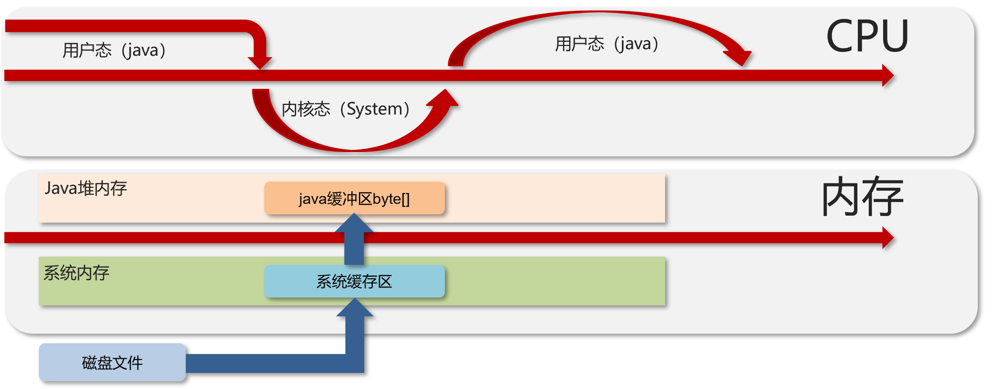

NIO：

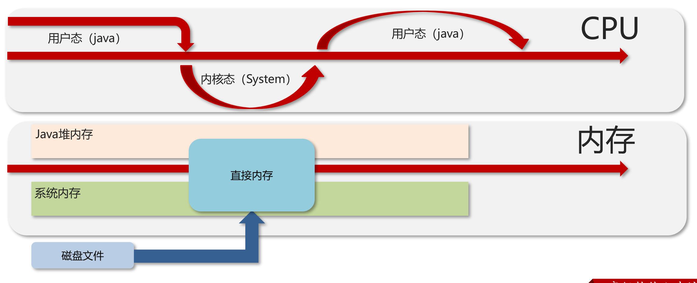

# 类加载器

## 介绍

> 什么是类加载器

JVM只会运行二进制文件，类加载器的作用就是将字节码文件加载到JVM中，从而让Java程序能够启动起来。

> 类加载器有哪些

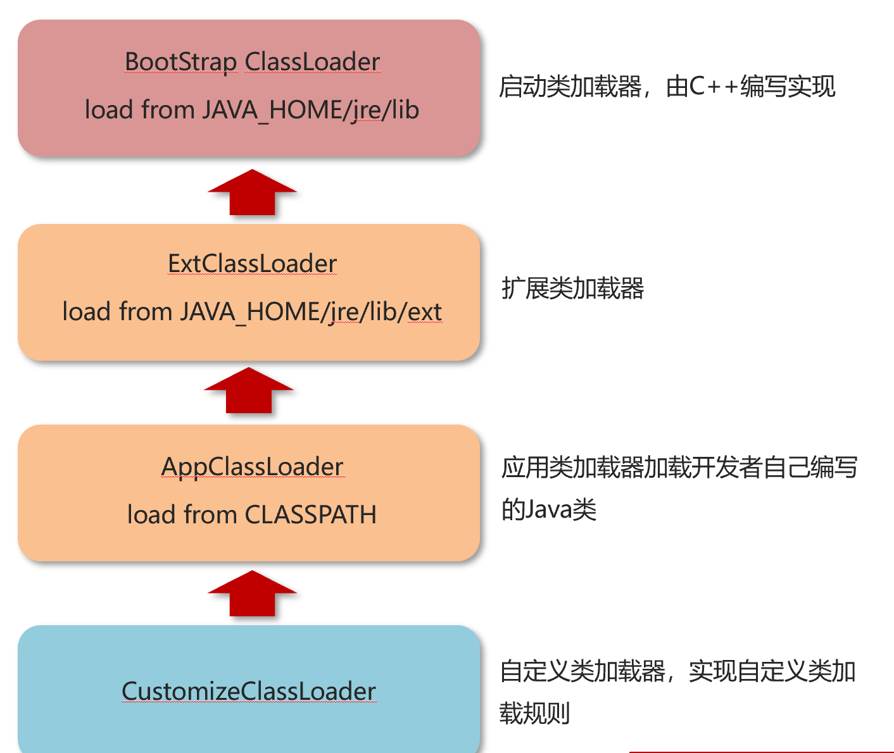

## 类加载器加载过程

类从加载到虚拟机中开始，直到卸载为止，它的整个生命周期包括了：加载、验证、准备、解析、初始化、使用和卸载这7个阶段。其中，验证、准备和解析这三个部分统称为连接（linking）

### 加载

* 通过类的全名，获取类的二进制数据流。

* 解析类的二进制数据流到方法区内的数据结构（Java类模型） 

* 创建java.lang.Class类的实例，表示该类型。作为方法区这个类的各种数据的访问入口

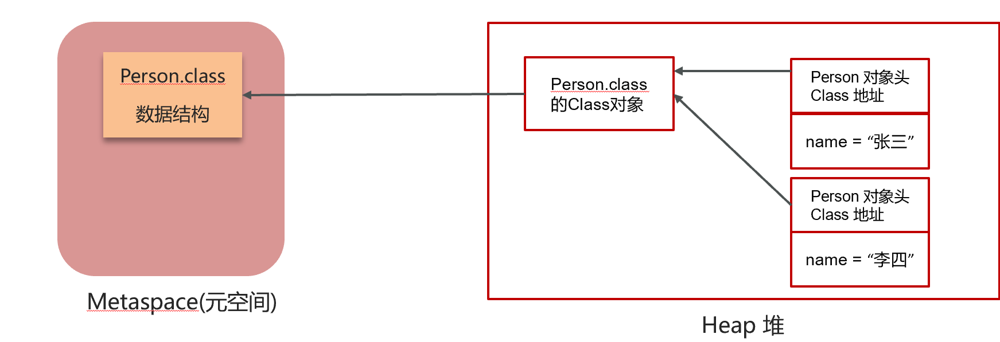

### 验证

验证类是否符合 JVM规范，安全性检查

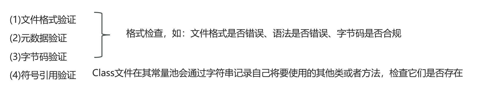

### 准备

**为类变量分配内存并设置类变量初始值**

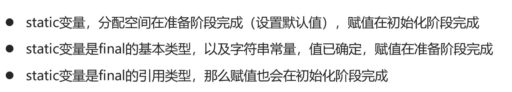

### 解析

**把类中的符号引用转换为直接引用**，比如：方法中调用了其他方法，方法名可以理解为符号引用，而直接引用就是使用指针直接指向方法。

从

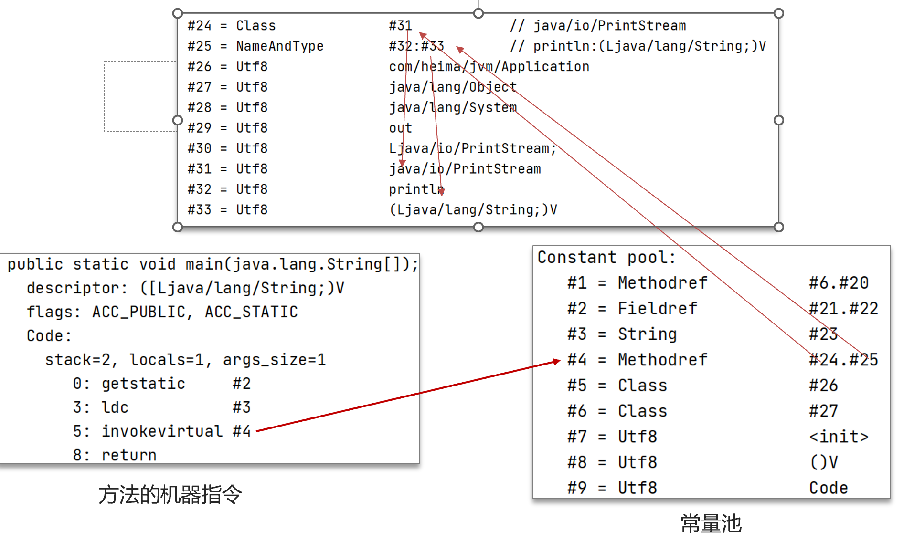

到

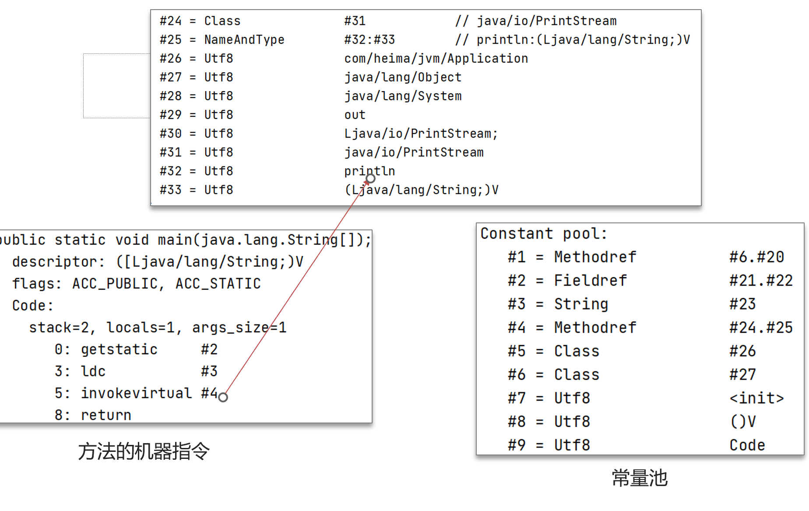

### 初始化

**对类的静态变量，静态代码块执行初始化操作**

* 如果初始化一个类的时候，其父类尚未初始化，则优先初始化其父类。

* 如果同时包含多个静态变量和静态代码块，则按照自上而下的顺序依次执行。

* 当只使用父类的静态变量就会只初始化父类的静态代码块，而不会初始化子类的静态代码块。

### 使用

JVM 开始从入口方法开始执行用户的程序代码

* 调用静态类成员信息（比如：静态字段、静态方法）

* 使用new关键字为其创建对象实例

### 总结

* 加载:查找和导入class文件

* 验证:保证加载类的准确性

* 准备:为类变量分配内存并设置类变量初始值

*  解析:把类中的符号引用转换为直接引用

* 初始化:对类的静态变量，静态代码块执行初始化操作

* 使用:JVM 开始从入口方法开始执行用户的程序代码

* 卸载:当用户程序代码执行完毕后，JVM便开始销毁创建的Class对象。

## 双亲委派机制

> 什么是双亲委派模型？

加载某一个类，先委托上一级的加载器进行加载，如果上级加载器也有上级，则会继续向上委托，如果该类委托上级没有被加载，子加载器尝试加载该类

> JVM为什么采用双亲委派机制？

* 通过双亲委派机制可以避免某一个类被重复加载，当父类已经加载后则无需重复加载，保证唯一性。

* 为了安全，保证类库API不会被修改

# 垃圾回收

> 对象什么时候可以被垃圾器回收

如果一个或多个对象没有任何的引用指向它了，那么这个对象现在就是垃圾，如果定位了垃圾，则有可能会被垃圾回收器回收。

> 定位垃圾的方式

* 引用计数法

  一个对象被引用了一次，在当前的对象头上递增一次引用次数，如果这个对象的引用次数为0，代表这个对象可回收。

  当对象间出现了循环引用的话，则引用计数法可能就会失效。

* 可达性分析算法

  现在的虚拟机采用的都是通过可达性分析算法来确定哪些内容是垃圾。

  扫描堆中的对象，看是否能够沿着 GC Root 对象 为起点的引用链找到该对象，找不到，表示可以回收。

> 哪些对象可以作为 GC Root 

* 虚拟机栈（栈帧中的本地变量表）中引用的对象

* 方法区中类静态属性引用的对象

* 方法区中常量引用的对象

## 垃圾回收算法

> JVM 垃圾回收算法有哪些？

* 标记清除算法：垃圾回收分为2个阶段，分别是标记和清除,效率高,有磁盘碎片，内存不连续------一般不使用

* 标记整理算法：标记清除算法一样，将存活对象都向内存另一端移动，然后清理边界以外的垃圾，无碎片，对象需要移动，效率低------一般用于老年代

* 复制算法：将原有的内存空间一分为二，每次只用其中的一块,正在使用的对象复制到另一个内存空间中，然后将该内存空间清空，交换两个内存的角色，完成垃圾的回收;无碎片，内存使用率低--------一般用于年轻代

### 标记清除算法

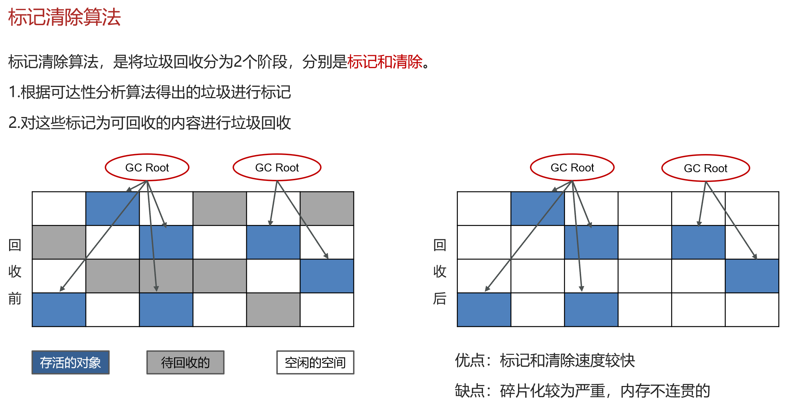

### 标记整理算法

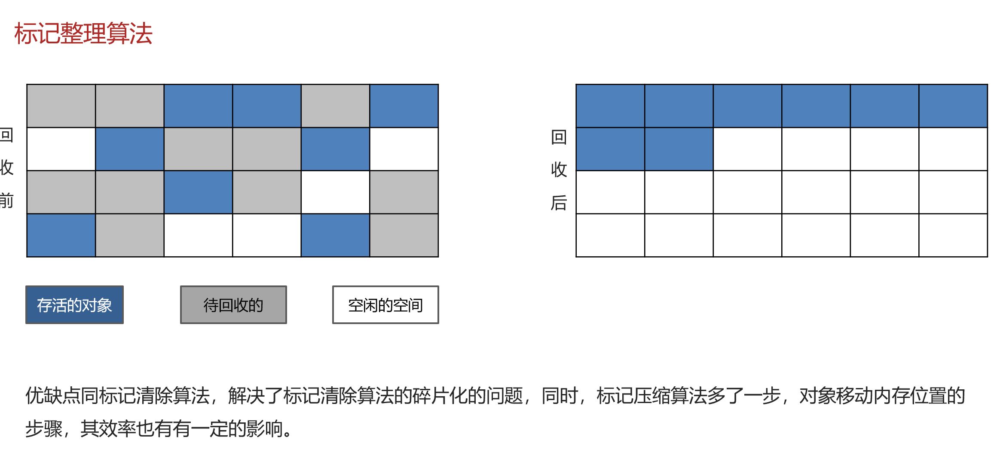

### 整理算法

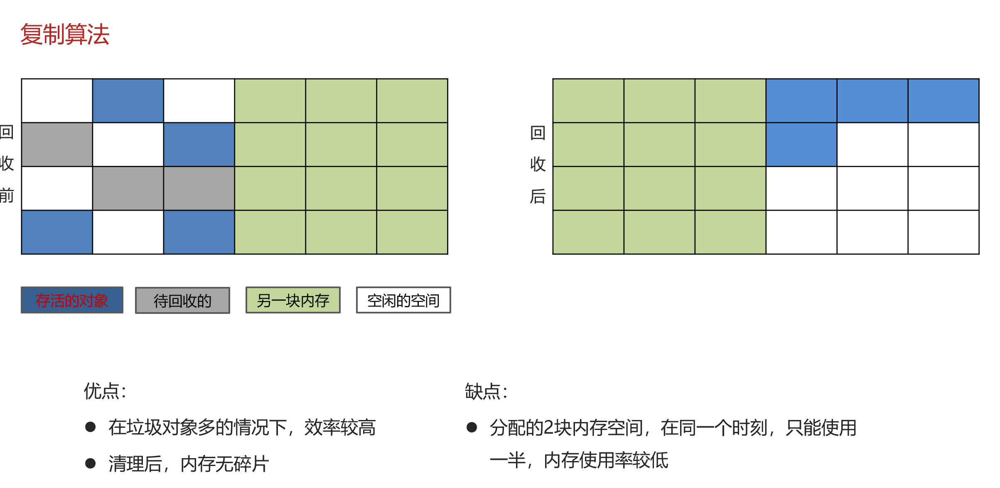

## 分代垃圾回收

> 说一下JVM中的分代回收

一、堆的区域划分

* 堆被分为了两份：新生代和老年代【1：2】

* 对于新生代，内部又被分为了三个区域。Eden区，幸存者区survivor(分成from和to)【8：1：1】

二、对象回收分代回收策略

* 新创建的对象，都会先分配到eden区

* 当Eden内存不足，标记Eden与 from（现阶段没有）的存活对象

* 将存活对象采用复制算法复制到to中，复制完毕后，Eden和 from 内存都得到释放

* 经过一段时间后Eden的内存又出现不足，标记eden区域to区存活的对象，将其复制到from区

* 当幸存区对象熬过几次回收（最多15次），晋升到老年代（当幸存区内存不足或大对象会提前晋升）

> MinorGC、 Mixed GC 、 FullGC的区别是什么

* MinorGC【young GC】发生在新生代的垃圾回收，暂停时间短（STW）--------->STW（Stop-The-World）：暂停所有应用程序线程，等待垃圾回收的完成。

* Mixed GC 新生代 + 老年代部分区域的垃圾回收，G1 收集器特有

* FullGC： 新生代 + 老年代完整垃圾回收，暂停时间长（STW），应尽力避免

## 垃圾回收器

> 在jvm中，实现了多种垃圾收集器，主要包括

* 串行垃圾收集器：Serial(色vu) GC、Serial Old GC

* 并行垃圾收集器：Parallel(破ruiv) Old GC、ParNew GC

* CMS（并发）垃圾收集器：CMS GC，作用在老年代

* G1垃圾收集器，作用在新生代和老年代

### 串行垃圾回收器

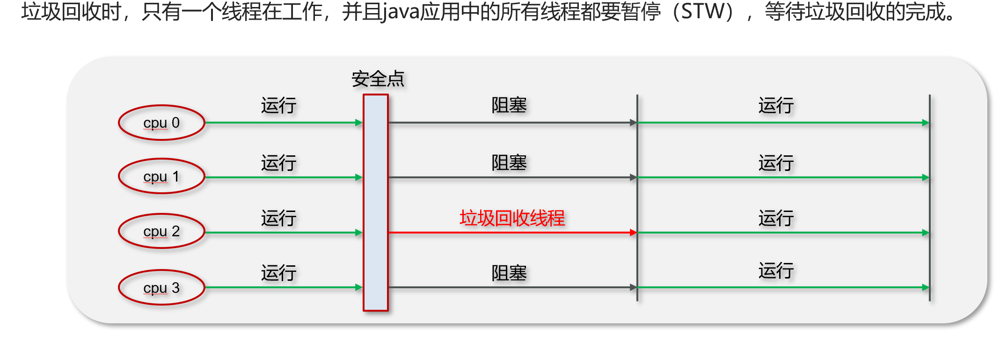

### 并行垃圾回收器

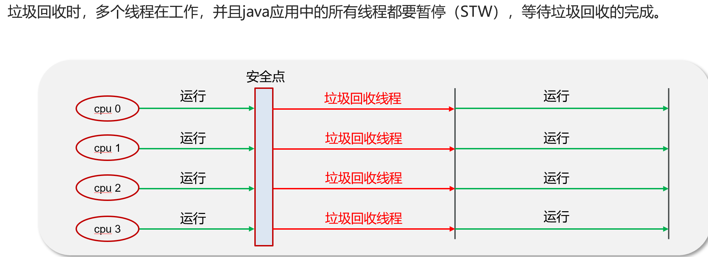

### 并发垃圾回收器

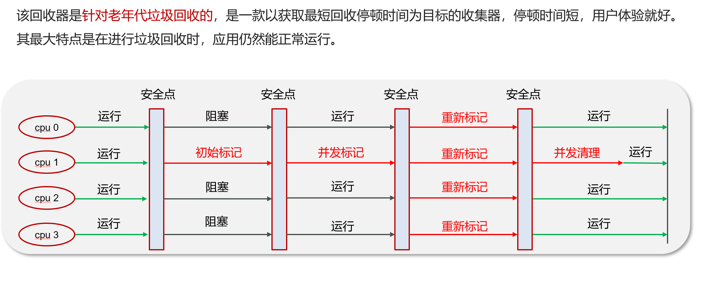

### G1垃圾回收器

* 应用于新生代和老年代，在JDK9之后默认使用G1

* 划分成多个区域，每个区域都可以充当 eden，survivor，old， humongous，其中 humongous 专为大对象准备

* 采用复制算法

* 响应时间与吞吐量兼顾

* 分成三个阶段：新生代回收(stw)、并发标记(重新标记stw)、混合收集

* 如果并发失败（即回收速度赶不上创建新对象速度），会触发 Full GC

[G1垃圾回收器执行过程](G1垃圾回收器.pptx)

## 四种引用

> 强引用、软引用、弱引用、虚引用的区别?

* 强引用：只要所有 GC Roots 能找到，就不会被回收

* 软引用：需要配合SoftReference使用，当垃圾多次回收，内存依然不够的时候会回收软引用对象

* 弱引用：需要配合WeakReference使用，只要进行了垃圾回收，就会把弱引用对象回收

* 虚引用：必须配合引用队列使用，被引用对象回收时，会将虚引用PhantomReference入队，由 Reference Handler 线程调用虚引用相关方法释放直接内存

# jvm实践

> JVM 调优的参数可以在哪里设置参数值

* war包部署在tomcat中设置

​    修改TOMCAT_HOME/bin/catalina.sh文件

* jar包部署在启动参数设置

​     java -Xms512m -Xmx1024m -jar xxxx.jar

## JVM 调优的参数

### 设置堆空间大小

设置堆的初始大小和最大大小，为了防止垃圾收集器在初始大小、最大大小之间收缩堆而产生额外的时间，通常把最大、初始大小设置为相同的值。

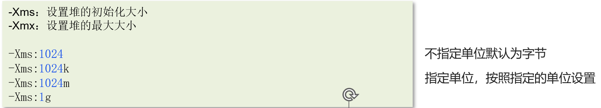

堆空间设置多少合适？

* 最大大小的默认值是物理内存的1/4，初始大小是物理内存的1/64

* 堆太小，可能会频繁的导致年轻代和老年代的垃圾回收，会产生stw，暂停用户线程

* 堆内存大肯定是好的，存在风险，假如发生了fullgc,它会扫描整个堆空间，暂停用户线程的时间长

* 设置参考推荐：尽量大，也要考察一下当前计算机其他程序的内存使用情况

### 设置虚拟机栈大小

虚拟机栈的设置：每个线程默认会开启1M的内存，用于存放栈帧、调用参数、局部变量等，但一般256K就够用。通常减少每个线程的堆栈，可以产生更多的线程，但这实际上还受限于操作系统。

### Eden区和两个Survivor区的大小比例

设置年轻代中Eden区和两个Survivor区的大小比例。该值如果不设置，则默认比例为8:1:1。通过增大Eden区的大小，来减少YGC发生的次数，但有时我们发现，虽然次数减少了，但Eden区满的时候，由于占用的空间较大，导致释放缓慢，此时STW的时间较长，因此需要按照程序情况去调优。

### 年轻代晋升老年代阈值

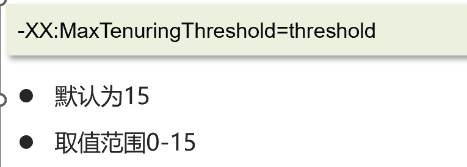

### 设置垃圾回收收集器

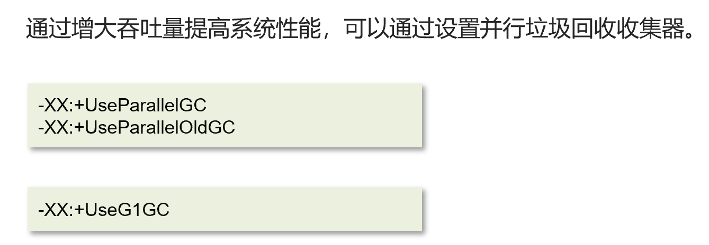

## JVM 调优的工具

命令工具

* jps     进程状态信息

* jstack   查看java进程内线程的堆栈信息

* jmap   查看堆转信息

* jhat    堆转储快照分析工具

* jstat   JVM统计监测工具

可视化工具

* jconsole   用于对jvm的内存，线程，类 的监控

* VisualVM  能够监控线程，内存情况

## 内存泄漏排查

> java内存泄露的排查思路？

内存泄漏通常是指堆内存，通常是指一些大对象不被回收的情况

1、通过jmap或设置jvm参数(当项目刚启动就闪退只能使用参数方式)获取堆内存快照dump

2、通过工具， VisualVM去分析dump文件，VisualVM可以加载离线的dump文件

3、通过查看堆信息的情况，可以大概定位内存溢出是哪行代码出了问题

4、找到对应的代码，通过阅读上下文的情况，进行修复即可

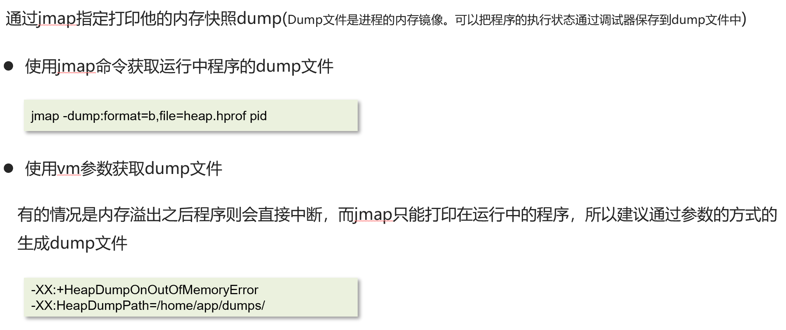

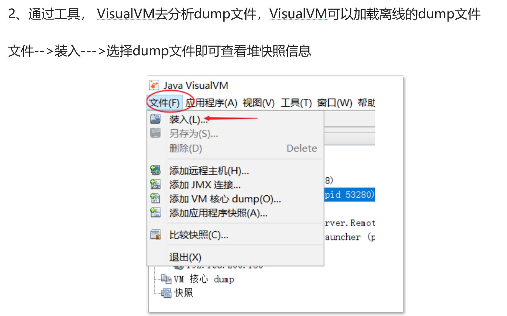

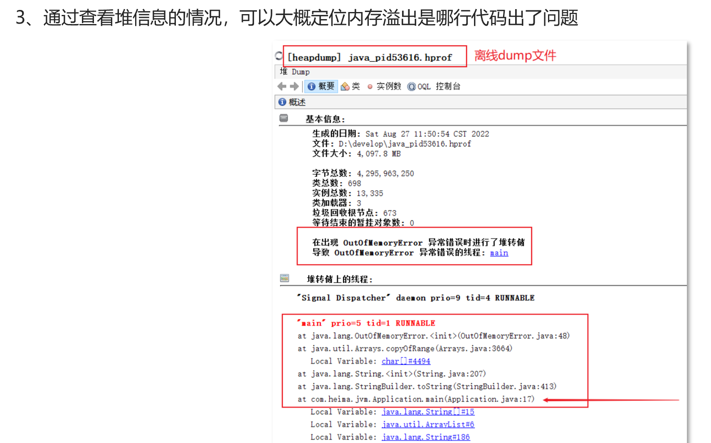

## CPU飙升排查

1.使用top命令查看占用cpu的情况

2.通过top命令查看后，可以查看是哪一个进程占用cpu较高

3.使用ps命令查看进程中的线程信息

4.使用jstack命令查看进程中哪些线程出现了问题，最终定位问题