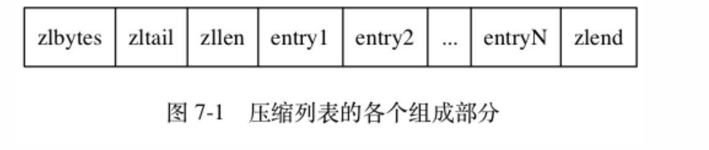

# 数据结构

## 数据结构与数据类型的关系


## 简单动态字符串

```Redis自己构建了一种名为简单动态字符串(simple dynamic string, SDS)的抽象类型，并将其作为默认字符串使用```

### SDS定义

```c
struct sdshdr{
    
    //记录buf数组中已经使用的字节的数量
    //等于SDS所保存的字符串的长度
    int len;
    
    //记录为sds分配的长度
    int alloc;
    
    //用来表示不同类型的 SDS。一共设计了 5 种类型，分别是 sdshdr5、sdshdr8、sdshdr16、sdshdr32 和 sdshdr64
    int flags;
    
    //字节数组,用于保存字符串
    char buf[];
}
```

### SDS与C字符转区别

* 常数复杂度获取字符串长度

  ```sdshdr结构体中的len属性```

* 杜绝缓冲区溢出

  ```当SDS API需要对SDS进行修改时，API会先检查SDS的空间是否满足修改所需的要求，如果不满足的话，API会自动将SDS的空间扩展至执行修改所需的大小，然后执行修改操作；```

  ```而C字符串容易造成缓冲区溢出，如strcat函数可能修改别的内存空间，造成程序问题```

* 减少修改字符串时带来的内存重分配次数

  ```通过未使用空间来减少内存重分配次数```

  主要有两种优化策略

  - 空间预分配

    ```当SDS的API对一个SDS进行修改并且需要对SDS进行空间扩展的时候，程序不仅会为SDS分配修改所必须要的空间，还会为SDS分配额外的未使用空间```

  - 惰性空间释放

    ```当SDS的API需要缩短SDS保存的字符串时，程序并不立即使用内存重分配来回收缩短后多出来的字节，而是使用free属性将这些字节的数量记录起来，并等待将来使用```

* 二进制安全

  ```SDS虽然使用'\0'结尾但是由于有len属性，并会造成二进制安全问题；而C字符串就不能保存像图片、音频、视频这样的二进制数据```

* 兼容部分C字符串函数

  ```SDS和C字符串一样以'\0'结尾```

### SDS扩容规则

```c
hisds hi_sdsMakeRoomFor(hisds s, size_t addlen){
    ... ...
    // s目前的剩余空间已足够，无需扩展，直接返回
    if (avail >= addlen)
        return s;
    //获取目前s的长度
    len = hi_sdslen(s);
    ...
    //扩展之后 s 至少需要的长度
    newlen = (len + addlen);
    //根据新长度，为s分配新空间所需要的大小
    if (newlen < HI_SDS_MAX_PREALLOC) //HI_SDS_MAX_PREALLOC -> 1M
        //新长度<HI_SDS_MAX_PREALLOC 则分配所需空间*2的空间
        newlen *= 2;
    else
        //否则，分配长度为目前长度+1MB
        newlen += HI_SDS_MAX_PREALLOC;
       ...
}
```

- 如果所需的 sds 长度**小于 1 MB**，那么最后的扩容是按照**翻倍扩容**来执行的，即 2 倍的newlen
- 如果所需的 sds 长度**超过 1 MB**，那么最后的扩容长度应该是 newlen **+ 1MB**。

### 重点回顾

- Redis 只会使用 C 字符串作为字面量， 在大多数情况下， Redis 使用 SDS （Simple Dynamic String，简单动态字符串）作为字符串表示。
- 比起 C 字符串， SDS 具有以下优点：
  1. 常数复杂度获取字符串长度。
  2. 杜绝缓冲区溢出。
  3. 减少修改字符串长度时所需的内存重分配次数。
  4. 二进制安全。
  5. 兼容部分 C 字符串函数。

## 链表

链表在 Redis 中的应用非常广泛， 比如列表键的底层实现之一就是链表： 当一个列表键包含了数量比较多的元素， 又或者列表中包含的元素都是比较长的字符串时， Redis 就会使用链表作为列表键的底层实现，除了链表键之外， 发布与订阅、慢查询、监视器等功能也用到了链表。

### 链表的实现

节点

```c
typedef struct listNode {

    // 前置节点
    struct listNode *prev;

    // 后置节点
    struct listNode *next;

    // 节点的值
    void *value;

} listNode;
```

链表

```c
typedef struct list {

    // 表头节点
    listNode *head;

    // 表尾节点
    listNode *tail;

    // 链表所包含的节点数量
    unsigned long len;

    // 节点值复制函数
    void *(*dup)(void *ptr);

    // 节点值释放函数
    void (*free)(void *ptr);

    // 节点值对比函数
    int (*match)(void *ptr, void *key);

} list;
```

```Redis链表是使用双端链表实现的```

### 重点回顾

- 链表被广泛用于实现 Redis 的各种功能， 比如列表键， 发布与订阅， 慢查询， 监视器， 等等。
- 每个链表节点由一个 `listNode` 结构来表示， 每个节点都有一个指向前置节点和后置节点的指针， 所以 Redis 的链表实现是双端链表。
- 每个链表使用一个 `list` 结构来表示， 这个结构带有表头节点指针、表尾节点指针、以及链表长度等信息。
- 因为链表表头节点的前置节点和表尾节点的后置节点都指向 `NULL` ， 所以 Redis 的链表实现是无环链表。
- 通过为链表设置不同的类型特定函数， Redis 的链表可以用于保存各种不同类型的值。

## 字典

### 字典的实现

哈希表

```c
typedef struct dictht {

    // 哈希表数组
    dictEntry **table;

    // 哈希表大小
    unsigned long size;

    // 哈希表大小掩码，用于计算索引值
    // 总是等于 size - 1
    unsigned long sizemask;//(size为2^n,计算下标%size可以写为&size-1)

    // 该哈希表已有节点的数量
    unsigned long used;

} dictht;
```

哈希表节点

```c
typedef struct dictEntry {

    // 键
    void *key;

    // 值
    union {
        void *val;
        uint64_t u64;
        int64_t s64;
    } v;
    /*
    dictEntry 结构里键值对中的值是一个「联合体 v」定义的，因此，键值对中的值可以是一个指向实际值的指针，或者是一个无符号的 64 位整数或有符号的 64 位整数或double 类的值。这么做的好处是可以节省内存空间，因为当「值」是整数或浮点数时，就可以将值的数据内嵌在 dictEntry 结构里，无需再用一个指针指向实际的值，从而节省了内存空间。
    */

    // 指向下个哈希表节点，形成链表
    struct dictEntry *next;

} dictEntry;
```

字典

```c
typedef struct dict {

    // 类型特定函数
    dictType *type;

    // 私有数据
    void *privdata;//保存了需要传递给那些类型特定函数的可选参数
    
    //type和privdata属性是针对不同类型的键值对，为创建多态字典而设置的

    // 哈希表
    dictht ht[2];

    // rehash 索引
    // 当 rehash 不在进行时，值为 -1
    int rehashidx; /* rehashing not in progress if rehashidx == -1 */

} dict;
```

### 哈希算法

Redis使用的哈希算法

```shell
# 使用字典设置的哈希函数，计算键 key 的哈希值
hash = dict->type->hashFunction(key);

# 使用哈希表的 sizemask 属性和哈希值，计算出索引值
# 根据情况不同， ht[x] 可以是 ht[0] 或者 ht[1]
index = hash & dict->ht[x].sizemask;
```

### 哈希冲突

Redis 的哈希表使用链地址法（separate chaining）来解决键冲突，因为 `dictEntry` 节点组成的链表没有指向链表表尾的指针， 所以为了速度考虑， 程序总是将新节点添加到链表的表头位置（复杂度为 ）， 排在其他已有节点的前面。

### rehash

随着操作的不断执行， 哈希表保存的键值对会逐渐地增多或者减少， 为了让哈希表的负载因子（load factor）维持在一个合理的范围之内， 当哈希表保存的键值对数量太多或者太少时， 程序需要对哈希表的大小进行相应的扩展或者收缩。

扩展和收缩哈希表的工作可以通过执行 rehash （重新散列）操作来完成， Redis 对字典的哈希表执行 rehash 的步骤如下：

1. 为字典的 ht[1] 哈希表分配空间， 这个哈希表的空间大小取决于要执行的操作， 以及 ht[0]当前包含的键值对数量 （也即是ht[0].used属性的值）：
   - 如果执行的是扩展操作， 那么 `ht[1]` 的大小为第一个大于等于 `ht[0].used * 2` 的  （`2` 的 `n` 次方幂）；
   - 如果执行的是收缩操作， 那么 `ht[1]` 的大小为第一个大于等于 `ht[0].used` 的  。
2. 将保存在ht[0]中的所有键值对 rehash 到ht[1] 上面： rehash 指的是重新计算键的哈希值和索引值， 然后将键值对放置到 ht[1] 哈希表的指定位置上。
3. 当ht[0] 包含的所有键值对都迁移到了ht[1] 之后 （ht[0] 变为空表）， 释放 ht[0] ， 将 ht[1] 设置为 ht[0] ， 并在ht[1] 新创建一个空白哈希表， 为下一次 rehash 做准备。

```复制到新表之后由于hashtable的size改变，sizemask改变，hash值可能改变，索引值可能改变```

### 渐进式rehash

rehash 动作并不是一次性、集中式地完成的， 而是分多次、渐进式地完成的，为了避免 rehash 对服务器性能造成影响， 服务器不是一次性将 `ht[0]` 里面的所有键值对全部 rehash 到 `ht[1]` ， 而是分多次、渐进式地将 `ht[0]` 里面的键值对慢慢地 rehash 到 `ht[1]` 。

以下是哈希表渐进式 rehash 的详细步骤：

1. 为 `ht[1]` 分配空间， 让字典同时持有 `ht[0]` 和 `ht[1]` 两个哈希表。
2. 在字典中维持一个索引计数器变量 `rehashidx` ， 并将它的值设置为 `0` ， 表示 rehash 工作正式开始。
3. 在 rehash 进行期间， 每次对字典执行添加、删除、查找或者更新操作时， 程序除了执行指定的操作以外， 还会顺带将 `ht[0]` 哈希表在 `rehashidx` 索引上的所有键值对 rehash 到 `ht[1]` ， 当 rehash 工作完成之后， 程序将 `rehashidx` 属性的值增一。
4. 随着字典操作的不断执行， 最终在某个时间点上， `ht[0]` 的所有键值对都会被 rehash 至 `ht[1]` ， 这时程序将 `rehashidx` 属性的值设为 `-1` ， 表示 rehash 操作已完成。

```执行渐进式 rehash 的过程中， 字典会同时使用ht[0]和ht[1]两个哈希表， 所以在渐进式 rehash 进行期间， 字典的删除（delete）、查找（find）、更新（update）等操作会在两个哈希表上进行： 比如说， 要在字典里面查找一个键的话， 程序会先在 ht[0] 里面进行查找， 如果没找到的话， 就会继续到 ht[1] 里面进行查找， 诸如此类。另外， 在渐进式 rehash 执行期间， 新添加到字典的键值对一律会被保存到 ht[1]里面， 而ht[0]则不再进行任何添加操作： 这一措施保证了ht[0]包含的键值对数量会只减不增， 并随着 rehash 操作的执行而最终变成空表。```

### rehash触发条件

介绍了 rehash 那么多，还没说什么时情况下会触发 rehash 操作呢？

rehash 的触发条件跟**负载因子（load factor）**有关系。

负载因子可以通过下面这个公式计算：

​			`负载因子 = 哈希表已保存节点数量 / 哈希表大小`

触发 rehash 操作的条件，主要有两个：

- **当负载因子大于等于 1 ，并且 Redis 没有在执行 bgsave 命令或者 bgrewiteaof 命令，也就是没有执行 RDB 快照或没有进行 AOF 重写的时候，就会进行 rehash 操作。**
- **当负载因子大于等于 5 时，此时说明哈希冲突非常严重了，不管有没有有在执行 RDB 快照或 AOF 重写，都会强制进行 rehash 操作。**

### 重点回顾

- 字典被广泛用于实现 Redis 的各种功能， 其中包括数据库和哈希键。
- Redis 中的字典使用哈希表作为底层实现， 每个字典带有两个哈希表， 一个用于平时使用， 另一个仅在进行 rehash 时使用。
- 当字典被用作数据库的底层实现， 或者哈希键的底层实现时， Redis 使用 MurmurHash2 算法来计算键的哈希值。
- 哈希表使用链地址法来解决键冲突， 被分配到同一个索引上的多个键值对会连接成一个单向链表。
- 在对哈希表进行扩展或者收缩操作时， 程序需要将现有哈希表包含的所有键值对 rehash 到新哈希表里面， 并且这个 rehash 过程并不是一次性地完成的， 而是渐进式地完成的。

## 跳跃表

Redis 只有 Zset 对象的底层实现用到了跳表，跳表的优势是能支持平均 O(logN) 复杂度的节点查找。

zset 结构体里有两个数据结构：一个是跳表，一个是哈希表。这样的好处是既能进行高效的范围查询，也能进行高效单点查询。

```c
typedef struct zset {
    dict *dict;
    zskiplist *zsl;
} zset;
```

Zset 对象在执行数据插入或是数据更新的过程中，会依次在跳表和哈希表中插入或更新相应的数据，从而保证了跳表和哈希表中记录的信息一致。

Zset 对象能支持范围查询（如 ZRANGEBYSCORE 操作），这是因为它的数据结构设计采用了跳表，而又能以常数复杂度获取元素权重（如 ZSCORE 操作），这是因为它同时采用了哈希表进行索引。


### 跳跃表的实现

跳跃表节点

```c
typedef struct zskiplistNode {

    // 后退指针
    struct zskiplistNode *backward;//节点的后退指针 ( backward 属性 ) 用于从表尾向表头方向访问节点：跟可以一次跳过多个节点的前进指针不同，因为每个节点只有一个后退指针，所以每次只能后退至前一个节点。
    

    // 分值
    double score;//节点的分值(score属性)是一个double类型的浮点数，跳跃表中的所有节点都按分值从小到大来排序。

    // 成员对象
    sds ele;

    /*在同一个跳跃表中，各个节点保存的成员对象必须是唯一的，但是多个节点保存的分值却可以是相同的：
    分值相同的节点将按照成员对象在字典中的大小来进行排序，成员对象较小的节点会排在前面(靠近表头的方向)，
    而成员对象较大的节点则会排在后面(靠近表尾的方向)。*/
    
    // 层
    struct zskiplistLevel {

        // 前进指针
        struct zskiplistNode *forward;

        // 跨度
        unsigned int span;//跨度实际上是为了计算这个节点在跳表中的排位。具体怎么做的呢？因为跳表中的节点都是按序排列的，那么计算某个节点排位的时候，从头节点点到该结点的查询路径上，将沿途访问过的所有层的跨度累加起来，得到的结果就是目标节点在跳表中的排位。

    } level[];//每个跳跃表节点的层高都是1到32之间的随机数

} zskiplistNode;
```

跳跃表

```c
typedef struct zskiplist {
    //表头节点和表尾节点
    typedef zskiplistNode *header, *tail;
    
    //表中节点数量
    unsigned long length;
    
    //表中层数最大的节点的层数
    int level;
    
}
```


### 跳跃表的查询过程

查找一个跳表节点的过程时，跳表会从头节点的最高层开始，逐一遍历每一层。在遍历某一层的跳表节点时，会用跳表节点中的 SDS 类型的元素和元素的权重来进行判断，共有两个判断条件：

- 如果当前节点的权重「小于」要查找的权重时，跳表就会访问该层上的下一个节点。
- 如果当前节点的权重「等于」要查找的权重时，并且当前节点的 SDS 类型数据「小于」要查找的数据时，跳表就会访问该层上的下一个节点。

如果上面两个条件都不满足，或者下一个节点为空时，跳表就会使用目前遍历到的节点的 level 数组里的下一层指针，然后沿着下一层指针继续查找，这就相当于跳到了下一层接着查找。

举个例子，下图有个 3 层级的跳表。


如果要查找「元素：abcd，权重：4」的节点，查找的过程是这样的：

- 先从头节点的最高层开始，L2 指向了「元素：abc，权重：3」节点，这个节点的权重比要查找节点的小，所以要访问该层上的下一个节点；
- 但是该层的下一个节点是空节点（ leve[2]指向的是空节点），于是就会跳到「元素：abc，权重：3」节点的下一层去找，也就是 leve[1];
- 「元素：abc，权重：3」节点的 leve[1] 的下一个指针指向了「元素：abcde，权重：4」的节点，然后将其和要查找的节点比较。虽然「元素：abcde，权重：4」的节点的权重和要查找的权重相同，但是当前节点的 SDS 类型数据「大于」要查找的数据，所以会继续跳到「元素：abc，权重：3」节点的下一层去找，也就是 leve[0]；
- 「元素：abc，权重：3」节点的 leve[0] 的下一个指针指向了「元素：abcd，权重：4」的节点，该节点正是要查找的节点，查询结束。

### 跳表节点层数的设置

### 跳表节点层数设置

跳表的相邻两层的节点数量的比例会影响跳表的查询性能。

举个例子，下图的跳表，第二层的节点数量只有 1 个，而第一层的节点数量有 6 个。


这时，如果想要查询节点 6，那基本就跟链表的查询复杂度一样，就需要在第一层的节点中依次顺序查找，复杂度就是 O(N) 了。所以，为了降低查询复杂度，我们就需要维持相邻层结点数间的关系。

**跳表的相邻两层的节点数量最理想的比例是 2:1，查找复杂度可以降低到 O(logN)**。

下图的跳表就是，相邻两层的节点数量的比例是 2 : 1。


> 那怎样才能维持相邻两层的节点数量的比例为 2 : 1 呢？

如果采用新增节点或者删除节点时，来调整跳表节点以维持比例的方法的话，会带来额外的开销。

Redis 则采用一种巧妙的方法是，**跳表在创建节点的时候，随机生成每个节点的层数**，并没有严格维持相邻两层的节点数量比例为 2 : 1 的情况。

具体的做法是，**跳表在创建节点时候，会生成范围为[0-1]的一个随机数，如果这个随机数小于 0.25（相当于概率 25%），那么层数就增加 1 层，然后继续生成下一个随机数，直到随机数的结果大于 0.25 结束，最终确定该节点的层数**。

参数p设置的小,层数变高的可能性越大，内存占用越大；设置的大，层数变矮的可能性越大，查找效率越低。

这样的做法，相当于每增加一层的概率不超过 25%，层数越高，概率越低，层高最大限制是 64。

### 为什么不使用平衡树

- **从内存占用上来比较，跳表比平衡树更灵活一些**。平衡树每个节点包含 2 个指针（分别指向左右子树），而跳表每个节点包含的指针数目平均为 1/(1-p)，具体取决于参数 p 的大小。如果像 Redis里的实现一样，取 p=1/4，那么平均每个节点包含 1.33 个指针，比平衡树更有优势。
- **在做范围查找的时候，跳表比平衡树操作要简单**。在平衡树上，我们找到指定范围的小值之后，还需要以中序遍历的顺序继续寻找其它不超过大值的节点。如果不对平衡树进行一定的改造，这里的中序遍历并不容易实现。而在跳表上进行范围查找就非常简单，只需要在找到小值之后，对第 1 层链表进行若干步的遍历就可以实现。
- **从算法实现难度上来比较，跳表比平衡树要简单得多**。平衡树的插入和删除操作可能引发子树的调整，逻辑复杂，而跳表的插入和删除只需要修改相邻节点的指针，操作简单又快速。

### 重点回顾

- 跳跃表是有序集合的底层实现之一， 除此之外它在 Redis 中没有其他应用。
- Redis 的跳跃表实现由 `zskiplist` 和 `zskiplistNode` 两个结构组成， 其中 `zskiplist` 用于保存跳跃表信息（比如表头节点、表尾节点、长度）， 而 `zskiplistNode` 则用于表示跳跃表节点。
- 每个跳跃表节点的层高都是 `1` 至 `32` 之间的随机数。
- 在同一个跳跃表中， 多个节点可以包含相同的分值， 但每个节点的成员对象必须是唯一的。
- 跳跃表中的节点按照分值大小进行排序， 当分值相同时， 节点按照成员对象的大小进行排序。

## 整数集合

整数集合是 Set 对象的底层实现之一。当一个 Set 对象只包含整数值元素，并且元素数量不大时，就会使用整数集这个数据结构作为底层实现。

### 整数集合的实现

```c
typedef struct intset {

    // 编码方式
    uint32_t encoding;

    // 集合包含的元素数量
    uint32_t length;

    // 保存元素的数组
    int8_t contents[];
    /*
    可以看到，保存元素的容器是一个 contents 数组，虽然 contents 被声明为 int8_t 类型的数组，但是实际上 contents 数组并不保存任何 int8_t 类型的元素，contents 数组的真正类型取决于 intset 结构体里的 encoding 属性的值。比如：
	如果 encoding 属性值为 INTSET_ENC_INT16，那么 contents 就是一个 int16_t 类型的数组，数组中每一个元素的类型都是 int16_t；
	如果 encoding 属性值为 INTSET_ENC_INT32，那么 contents 就是一个 int32_t 类型的数组，数组中每一个元素的类型都是 int32_t；
	如果 encoding 属性值为 INTSET_ENC_INT64，那么 contents 就是一个 int64_t 类型的数组，数组中每一个元素的类型都是 int64_t；
    */

} intset;
```

`contents` 数组是整数集合的底层实现： 整数集合的每个元素都是 `contents` 数组的一个数组项（item）， 各个项在数组中按值的大小从小到大有序地排列， 并且数组中不包含任何重复项。

### 升级

每当我们要将一个新元素添加到整数集合里面， 并且新元素的类型比整数集合现有所有元素的类型都要长时， 整数集合需要先进行升级（upgrade）， 然后才能将新元素添加到整数集合里面。

**升级之后新元素的摆放位置**

因为引发升级的新元素的长度总是比整数集合现有所有元素的长度都大， 所以这个新元素的值要么就大于所有现有元素， 要么就小于所有现有元素：

- 在新元素小于所有现有元素的情况下， 新元素会被放置在底层数组的最开头（索引 `0` ）；
- 在新元素大于所有现有元素的情况下， 新元素会被放置在底层数组的最末尾（索引 `length-1` ）。

**升级示例**

举个例子，假设有一个整数集合里有 3 个类型为 int16_t 的元素。


现在，往这个整数集合中加入一个新元素 65535，这个新元素需要用 int32_t 类型来保存，所以整数集合要进行升级操作，首先需要为 contents 数组扩容，**在原本空间的大小之上再扩容多 80 位（4x32-3x16=80），这样就能保存下 4 个类型为 int32_t 的元素**。


扩容完 contents 数组空间大小后，需要将之前的三个元素转换为 int32_t 类型，并将转换后的元素放置到正确的位上面，并且需要维持底层数组的有序性不变，整个转换过程如下：


**升级的好处**

* 提升灵活性

  因为 C 语言是静态类型语言， 为了避免类型错误， 我们通常不会将两种不同类型的值放在同一个数据结构里面。

  比如说， 我们一般只使用 `int16_t` 类型的数组来保存 `int16_t` 类型的值， 只使用 `int32_t` 类型的数组来保存 `int32_t` 类型的值， 诸如此类。

  但是， 因为整数集合可以通过自动升级底层数组来适应新元素， 所以我们可以随意地将 `int16_t` 、 `int32_t` 或者 `int64_t` 类型的整数添加到集合中， 而不必担心出现类型错误， 这种做法非常灵活。

* 节约内存

  当然， 要让一个数组可以同时保存 `int16_t` 、 `int32_t` 、 `int64_t` 三种类型的值， 最简单的做法就是直接使用 `int64_t` 类型的数组作为整数集合的底层实现。 不过这样一来， 即使添加到整数集合里面的都是 `int16_t` 类型或者 `int32_t` 类型的值， 数组都需要使用 `int64_t` 类型的空间去保存它们， 从而出现浪费内存的情况。

  而整数集合现在的做法既可以让集合能同时保存三种不同类型的值， 又可以确保升级操作只会在有需要的时候进行， 这可以尽量节省内存。

  比如说， 如果我们一直只向整数集合添加 `int16_t` 类型的值， 那么整数集合的底层实现就会一直是 `int16_t` 类型的数组， 只有在我们要将`int32_t` 类型或者 `int64_t` 类型的值添加到集合时， 程序才会对数组进行升级。

**整数集合不支持降级操作， 一旦对数组进行了升级， 编码就会一直保持升级后的状态。**

### 重点回顾

- 整数集合是集合键的底层实现之一。
- 整数集合的底层实现为数组， 这个数组以有序、无重复的方式保存集合元素， 在有需要时， 程序会根据新添加元素的类型， 改变这个数组的类型。
- 升级操作为整数集合带来了操作上的灵活性， 并且尽可能地节约了内存。
- 整数集合只支持升级操作， 不支持降级操作。

## 压缩列表

压缩列表（ziplist）是列表键和哈希键的底层实现之一。

当一个列表键只包含少量列表项， 并且每个列表项要么就是小整数值， 要么就是长度比较短的字符串， 那么 Redis 就会使用压缩列表来做列表键的底层实现。

当一个哈希键只包含少量键值对， 并且每个键值对的键和值要么就是小整数值， 要么就是长度比较短的字符串， 那么 Redis 就会使用压缩列表来做哈希键的底层实现。

压缩列表是 Redis 为了节约内存而开发的， 由一系列特殊编码的**连续内存块**组成的顺序型（sequential）数据结构。

### 压缩列表的构成

一个压缩列表可以包含任意多个节点（entry）， 每个节点可以保存一个字节数组或者一个整数值。

图 7-1 展示了压缩列表的各个组成部分， 表 7-1 则记录了各个组成部分的类型、长度、以及用途。



------

表 7-1 压缩列表各个组成部分的详细说明

| 属性      | 类型       | 长度     | 用途                                                         |
| :-------- | :--------- | :------- | :----------------------------------------------------------- |
| `zlbytes` | `uint32_t` | `4` 字节 | 记录整个压缩列表占用的内存字节数：在对压缩列表进行内存重分配， 或者计算 `zlend` 的位置时使用。 |
| `zltail`  | `uint32_t` | `4` 字节 | 记录压缩列表表尾节点距离压缩列表的起始地址有多少字节： 通过这个偏移量，程序无须遍历整个压缩列表就可以确定表尾节点的地址。 |
| `zllen`   | `uint16_t` | `2` 字节 | 记录了压缩列表包含的节点数量： 当这个属性的值小于 `UINT16_MAX` （`65535`）时， 这个属性的值就是压缩列表包含节点的数量； 当这个值等于 `UINT16_MAX` 时， 节点的真实数量需要遍历整个压缩列表才能计算得出。 |
| `entryX`  | 列表节点   | 不定     | 压缩列表包含的各个节点，节点的长度由节点保存的内容决定。     |
| `zlend`   | `uint8_t`  | `1` 字节 | 特殊值 `0xFF` （十进制 `255` ），用于标记压缩列表的末端。    |

### 压缩列表节点的构成

每个压缩列表节点都由 `previous_entry_length` 、 `encoding` 、 `content` 三个部分组成， 如图 7-4 所示。


* `previous_entry_length` 属性以字节为单位， 记录了压缩列表中前一个节点的长度：主要是为了实现从后向前遍历。
- 如果前一节点的长度小于 `254` 字节， 那么 `previous_entry_length` 属性的长度为 `1` 字节： 前一节点的长度就保存在这一个字节里面。
  
- 如果前一节点的长度大于等于 `254` 字节， 那么 `previous_entry_length` 属性的长度为 `5` 字节：
* `encoding` 属性记录了节点的 `content` 属性所保存数据的类型以及长度
* `content` 属性负责保存节点的值， 节点值可以是一个字节数组或者整数， 值的类型和长度由节点的 `encoding` 属性决定

当我们往压缩列表中插入数据时，压缩列表就会根据数据类型是字符串还是整数，以及数据的大小，会使用不同空间大小的 prevlen 和 encoding 这两个元素里保存的信息，**这种根据数据大小和类型进行不同的空间大小分配的设计思想，正是 Redis 为了节省内存而采用的**。

encoding 属性的空间大小跟数据是字符串还是整数，以及字符串的长度有关，如下图（下图中的 content 表示的是实际数据，即本文的 data 字段）：


- 如果**当前节点的数据是整数**，则 encoding 会使用 **1 字节的空间**进行编码，也就是 encoding 长度为 1 字节。通过 encoding 确认了整数类型，就可以确认整数数据的实际大小了，比如如果 encoding 编码确认了数据是 int16 整数，那么 data 的长度就是 int16 的大小。
- 如果**当前节点的数据是字符串，根据字符串的长度大小**，encoding 会使用 **1 字节/2字节/5字节的空间**进行编码，encoding 编码的前两个 bit 表示数据的类型，后续的其他 bit 标识字符串数据的实际长度，即 data 的长度。

### 压缩列表的连锁更新

### 连锁更新

压缩列表除了查找复杂度高的问题，还有一个问题。

**压缩列表新增某个元素或修改某个元素时，如果空间不不够，压缩列表占用的内存空间就需要重新分配。而当新插入的元素较大时，可能会导致后续元素的 prevlen 占用空间都发生变化，从而引起「连锁更新」问题，导致每个元素的空间都要重新分配，造成访问压缩列表性能的下降**。

前面提到，压缩列表节点的 prevlen 属性会根据前一个节点的长度进行不同的空间大小分配：

- 如果前一个**节点的长度小于 254 字节**，那么 prevlen 属性需要用 **1 字节的空间**来保存这个长度值；
- 如果前一个**节点的长度大于等于 254 字节**，那么 prevlen 属性需要用 **5 字节的空间**来保存这个长度值；

现在假设一个压缩列表中有多个连续的、长度在 250～253 之间的节点，如下图：


因为这些节点长度值小于 254 字节，所以 prevlen 属性需要用 1 字节的空间来保存这个长度值。

这时，如果将一个长度大于等于 254 字节的新节点加入到压缩列表的表头节点，即新节点将成为 e1 的前置节点，如下图：


因为 e1 节点的 prevlen 属性只有 1 个字节大小，无法保存新节点的长度，此时就需要对压缩列表的空间重分配操作，并将 e1 节点的 prevlen 属性从原来的 1 字节大小扩展为 5 字节大小。

多米诺牌的效应就此开始。


e1 原本的长度在 250～253 之间，因为刚才的扩展空间，此时 e1 的长度就大于等于 254 了，因此原本 e2 保存 e1 的 prevlen 属性也必须从 1 字节扩展至 5 字节大小。

正如扩展 e1 引发了对 e2 扩展一样，扩展 e2 也会引发对 e3 的扩展，而扩展 e3 又会引发对 e4 的扩展.... 一直持续到结尾。

**这种在特殊情况下产生的连续多次空间扩展操作就叫做「连锁更新」**，就像多米诺牌的效应一样，第一张牌倒下了，推动了第二张牌倒下；第二张牌倒下，又推动了第三张牌倒下....，

### 重点回顾

- 压缩列表是一种为节约内存而开发的顺序型数据结构。
- 压缩列表被用作列表键和哈希键的底层实现之一。
- 压缩列表可以包含多个节点，每个节点可以保存一个字节数组或者整数值。
- 添加新节点到压缩列表， 或者从压缩列表中删除节点， 可能会引发连锁更新操作， 但这种操作出现的几率并不高。

## 对象

Redis基于上面数据结构创建了一个对象系统， 这个系统包含字符串对象、列表对象、哈希对象、集合对象和有序集合对象这五种类型的对象， 每种对象都用到了至少一种我们前面所介绍的数据结构。

通过这五种不同类型的对象， Redis 可以在执行命令之前， 根据对象的类型来判断一个对象是否可以执行给定的命令。 使用对象的另一个好处是， 我们可以针对不同的使用场景， 为对象设置多种不同的数据结构实现， 从而优化对象在不同场景下的使用效率。

### 对象类型及编码

Redis 中的每个对象都由一个 `redisObject` 结构表示

```c
typedef struct redisObject {

    // 类型，记录了对象的类型
    unsigned type:4;

    // 编码
    unsigned encoding:4;

    // 指向底层实现数据结构的指针
    void *ptr;

    /*对象的 ptr 指针指向对象的底层实现数据结构， 而这些数据结构由对象的 encoding 属性决定。*/
    
    // ...

} robj;
```

### 字符串对象

如果字符串对象保存的是一个字符串值， 并且这个字符串值的长度小于等于 `39` 字节， 那么字符串对象将使用 `embstr` 编码的方式来保存这个字符串值。

这种编码和 `raw` 编码一样， 都使用 `redisObject` 结构和 `sdshdr` 结构来表示字符串对象， 但 `raw` 编码会调用两次内存分配函数来分别创建 `redisObject` 结构和 `sdshdr` 结构， 而 `embstr` 编码则通过调用一次内存分配函数来分配一块连续的空间， 空间中依次包含 `redisObject` 和 `sdshdr` 两个结构， 如图 8-3 所示。


`embstr` 编码的字符串对象在执行命令时， 产生的效果和 `raw` 编码的字符串对象执行命令时产生的效果是相同的， 但使用 `embstr` 编码的字符串对象来保存短字符串值有以下好处：

1. `embstr` 编码将创建字符串对象所需的内存分配次数从 `raw` 编码的两次降低为一次。
2. 释放 `embstr` 编码的字符串对象只需要调用一次内存释放函数， 而释放 `raw` 编码的字符串对象需要调用两次内存释放函数。
3. 因为 `embstr` 编码的字符串对象的所有数据都保存在一块连续的内存里面， 所以这种编码的字符串对象比起 `raw` 编码的字符串对象能够更好地利用缓存带来的优势。

`long double` 类型表示的浮点数在 Redis 中也是作为字符串值来保存的

#### 编码转换

* 对于 `int` 编码的字符串对象来说， 如果我们向对象执行了一些命令， 使得这个对象保存的不再是整数值， 而是一个字符串值， 那么字符串对象的编码将从 `int` 变为 `raw` 

* 因为 Redis 没有为 `embstr` 编码的字符串对象编写任何相应的修改程序 （只有 `int` 编码的字符串对象和 `raw` 编码的字符串对象有这些程序）， 所以 `embstr` 编码的字符串对象实际上是只读的： 当我们对 `embstr` 编码的字符串对象执行任何修改命令时， 程序会先将对象的编码从 `embstr` 转换成 `raw` ， 然后再执行修改命令； 因为这个原因， `embstr` 编码的字符串对象在执行修改命令之后， 总会变成一个 `raw` 编码的字符串对象。

### 列表对象

列表对象的编码可以是 `ziplist` 或者 `linkedlist` 。

#### 编码转换

当列表对象可以同时满足以下两个条件时， 列表对象使用 `ziplist` 编码：

1. 列表对象保存的所有字符串元素的长度都小于 `64` 字节；
2. 列表对象保存的元素数量小于 `512` 个；

不能满足这两个条件的列表对象需要使用 `linkedlist` 编码。

### 哈希对象

哈希对象的编码可以是 `ziplist` 或者 `hashtable` 。

`ziplist` 编码的哈希对象使用压缩列表作为底层实现， 每当有新的键值对要加入到哈希对象时， 程序会先将保存了键的压缩列表节点推入到压缩列表表尾， 然后再将保存了值的压缩列表节点推入到压缩列表表尾， 因此：

- 保存了同一键值对的两个节点总是紧挨在一起， 保存键的节点在前， 保存值的节点在后；
- 先添加到哈希对象中的键值对会被放在压缩列表的表头方向， 而后来添加到哈希对象中的键值对会被放在压缩列表的表尾方向。

`hashtable` 编码的哈希对象使用字典作为底层实现， 哈希对象中的每个键值对都使用一个字典键值对来保存：

- 字典的每个键都是一个字符串对象， 对象中保存了键值对的键；
- 字典的每个值都是一个字符串对象， 对象中保存了键值对的值。

#### 编码转换

当哈希对象可以同时满足以下两个条件时， 哈希对象使用 `ziplist` 编码：

1. 哈希对象保存的所有键值对的键和值的字符串长度都小于 `64` 字节；
2. 哈希对象保存的键值对数量小于 `512` 个；

不能满足这两个条件的哈希对象需要使用 `hashtable` 编码。

### 集合对象

集合对象的编码可以是 `intset` 或者 `hashtable` 。

`intset` 编码的集合对象使用整数集合作为底层实现， 集合对象包含的所有元素都被保存在整数集合里面。

`hashtable` 编码的集合对象使用字典作为底层实现， 字典的每个键都是一个字符串对象， 每个字符串对象包含了一个集合元素， 而字典的值则全部被设置为 `NULL` 。

#### 编码转换

当集合对象可以同时满足以下两个条件时， 对象使用 `intset` 编码：

1. 集合对象保存的所有元素都是整数值；
2. 集合对象保存的元素数量不超过 `512` 个；

### 有序集合对象

有序集合的编码可以是 `ziplist` 或者 `skiplist` 。

`ziplist` 编码的有序集合对象使用压缩列表作为底层实现， 每个集合元素使用两个紧挨在一起的压缩列表节点来保存， 第一个节点保存元素的成员（member）， 而第二个元素则保存元素的分值（score）。

压缩列表内的集合元素按分值从小到大进行排序， 分值较小的元素被放置在靠近表头的方向， 而分值较大的元素则被放置在靠近表尾的方向。

`skiplist` 编码的有序集合对象使用 `zset` 结构作为底层实现， 一个 `zset` 结构同时包含一个字典和一个跳跃表：

```c
typedef struct zset {

    zskiplist *zsl;

    dict *dict;

} zset;
```

有序集合每个元素的成员都是一个字符串对象， 而每个元素的分值都是一个 `double` 类型的浮点数。 值得一提的是， 虽然 `zset` 结构同时使用跳跃表和字典来保存有序集合元素， 但这两种数据结构都会通过指针来共享相同元素的成员和分值， 所以同时使用跳跃表和字典来保存集合元素不会产生任何重复成员或者分值， 也不会因此而浪费额外的内存。

#### 编码转换

当有序集合对象可以同时满足以下两个条件时， 对象使用 `ziplist` 编码：

1. 有序集合保存的元素数量小于 `128` 个；
2. 有序集合保存的所有元素成员的长度都小于 `64` 字节；

不能满足以上两个条件的有序集合对象将使用 `skiplist` 编码。

### 类型检查与命令多态

#### 类型检查

为了确保只有指定类型的键可以执行某些特定的命令， 在执行一个类型特定的命令之前， Redis 会先检查输入键的类型是否正确， 然后再决定是否执行给定的命令。

#### 命令多态

Redis 除了会根据值对象的类型来判断键是否能够执行指定命令之外， 还会根据值对象的编码方式， 选择正确的命令实现代码来执行命令。

### 内存回收

 Redis 在自己的对象系统中构建了一个引用计数（reference counting）技术实现的内存回收机制， 通过这一机制， 程序可以通过跟踪对象的引用计数信息， 在适当的时候自动释放对象并进行内存回收。

```c
typedef struct redisObject {

    // ...

    // 引用计数
    int refcount;

    // ...

} robj;
```

对象的引用计数信息会随着对象的使用状态而不断变化：

- 在创建一个新对象时， 引用计数的值会被初始化为 `1` ；
- 当对象被一个新程序使用时， 它的引用计数值会被增一；
- 当对象不再被一个程序使用时， 它的引用计数值会被减一；
- 当对象的引用计数值变为 `0` 时， 对象所占用的内存会被释放。

### 对象共享

除了用于实现引用计数内存回收机制之外， 对象的引用计数属性还带有对象共享的作用。

在 Redis 中， 让多个键共享同一个值对象需要执行以下两个步骤：

* 将数据库键的值指针指向一个现有的值对象；

* 将被共享的值对象的引用计数增一。

目前来说， Redis 会在初始化服务器时， 创建一万个字符串对象， 这些对象包含了从 `0` 到 `9999` 的所有整数值， 当服务器需要用到值为 `0`到 `9999` 的字符串对象时， 服务器就会使用这些共享对象， 而不是新创建对象。

#### 为什么 Redis 不共享包含字符串的对象？

当服务器考虑将一个共享对象设置为键的值对象时， 程序需要先检查给定的共享对象和键想创建的目标对象是否完全相同， 只有在共享对象和目标对象完全相同的情况下， 程序才会将共享对象用作键的值对象， 而一个共享对象保存的值越复杂， 验证共享对象和目标对象是否相同所需的复杂度就会越高， 消耗的 CPU 时间也会越多：

- 如果共享对象是保存整数值的字符串对象， 那么验证操作的复杂度为  ；
- 如果共享对象是保存字符串值的字符串对象， 那么验证操作的复杂度为  ；
- 如果共享对象是包含了多个值（或者对象的）对象， 比如列表对象或者哈希对象， 那么验证操作的复杂度将会是  。

因此， 尽管共享更复杂的对象可以节约更多的内存， 但受到 CPU 时间的限制， Redis 只对包含整数值的字符串对象进行共享。

### 对象空转时长

`redisObject` 结构包含的最后一个属性为 `lru` 属性， 该属性记录了对象最后一次被命令程序访问的时间：

```c
typedef struct redisObject {

    // 对象最后一次被命令程序访问的时间
    unsigned lru:22;

    // ...

} robj;
```

OBJECT IDLETIME 命令（空转时长）的实现是特殊的， 这个命令在访问键的值对象时， 不会修改值对象的 `lru` 属性。

 ### 重点回顾

- Redis 数据库中的每个键值对的键和值都是一个对象。
- Redis 共有字符串、列表、哈希、集合、有序集合五种类型的对象， 每种类型的对象至少都有两种或以上的编码方式， 不同的编码可以在不同的使用场景上优化对象的使用效率。
- 服务器在执行某些命令之前， 会先检查给定键的类型能否执行指定的命令， 而检查一个键的类型就是检查键的值对象的类型。
- Redis 的对象系统带有引用计数实现的内存回收机制， 当一个对象不再被使用时， 该对象所占用的内存就会被自动释放。
- Redis 会共享值为 `0` 到 `9999` 的字符串对象。
- 对象会记录自己的最后一次被访问的时间， 这个时间可以用于计算对象的空转时间。

# 单机数据库的实现

## 数据库

### 服务器中的数据库

Redis 是一个键值对（key-value pair）数据库服务器， 服务器中的每个数据库都由一个 `redis.h/redisDb` 结构表示， 其中， `redisDb` 结构的`dict` 字典保存了数据库中的所有键值对。

```c
struct redisServer{
	//..
    
    //一个数组，保存着服务器中的所有数据库
    redisDb *db;
    
    //服务器中的数据库的数量
    int dbnum;
    //..
};
```

```c
typedef struct redisDb {

    // ...

    // 数据库键空间，保存着数据库中的所有键值对
    dict *dict;

    // ...

} redisDb;
```

### 设置键的过期时间

实际上expire,pexpire,expireat三个命令都是使用PEXPIREAT命令实现的

### 保存过期时间

redisDb结构的expires字典保存了数据库中所有键的过期时间，称之为过期字典：

* 过期字典的键是一个指针，这个指针指向键空间中的某个键对象
* 过期字典的只是一个long long 类型的整数，这个整数保存了键所指向的数据库键的过期时间，是一个毫秒精度的UNIX时间戳

```c
typedef struct redisDb{
    //..
    
    //过期字典
    dict *expires;
    
    //..
}redisDb;
```

实际上过期字典的键空间的键和数据库键空间的键都指向同一个对象。

### 过期键的判定

通过过期字典，程序可以通过以下步骤检查一个给定的键是否过期：

	* 检查给定键是否存在于过期字典：如果存在，那么取得键的过期时间
	* 检查当前UNIX时间戳是否大于键的过期时间，如果是的话，那么键已经过期，否则，未过期。

### 过期键删除策略

* 定时删除：设置键的过期时间的同时创建一个定时器，让定时器在键的过期时间来临时，立即执行对键的删除操作

  `定期删除对内存最友好`

  `但是在过期键比较多的情况下，删除过期键会占用相当一部分CPU时间`

* 惰性删除：每次从键空间获取键时，都检查取得的键是否过期，如果过期就删除该键，没有过期，返回改键

  `对CPU时间最友好`

  `如果一个键已经过期，而这个键仍然保留在数据库中，对内存不友好`

* 定期删除：每隔一段时间，程序就对数据库进行一次检查，删除里面的过期键。

  从上面对定时删除和惰性删除的讨论来看，这两种删除方式在单一使用时都有明显的缺陷:

  - 定时删除占用太多CPU 时间，影响服务器的响应时间和吞吐量。
  - 惰性删除浪费太多内存，有内存泄漏的危险。

  定期删除策略是前两种策略的一种整合和折中:

  - 定期删除策略每隔一段时间执行一次删除过期键操作，并通过限制删除操作执行的
    时长和频率来减少删除操作对CPU时间的影响。
  - 除此之外，通过定期删除过期键，定期删除策略有效地减少了因为过期键而带来的
    内存浪费。

  定期删除策略的难点是确定删除操作执行的时长和频率:

  - 如果删除操作执行得太频繁，或者执行的时间太长，定期删除策略就会退化成定时
    删除策略，以至于将CPU时间过多地消耗在删除过期键上面。
  - 如果删除操作执行得太少，或者执行的时间太短，定期删除策略又会和惰性删除策
    略一样，出现浪费内存的情况。

  因此，如果采用定期删除策略的话，服务器必须根据情况，合理地设置删除操作的执行时长和执行频率。

Redis服务器实际上使用的是惰性删除和定期删除两种策略

#### 定期删除策略的实现


```python
#默认每次检查的数据库数量
DEFAULT_DB_NUMBERS = 16

#默认每个数据库检查的键数量
DEFAULT KEY NUMBERS = 20

#全局变量，记录检查进度
current_db = 0

def activeExpireCycle():
    #初始化要检查的数据库数量
    #如果服务器的数据库数量比DEFAULT_DB_NUMBERS 要小
    #那么以服务器的数据库数量为准

    if server .dbnum <DEFAULT_DB_NUMBERS:
    	db numbers = server.dbnum
    else:
    	db_numbers =DEFAULT_DB_NUMBERS
        
    #遍历各个数据库
    for i in range (db _numbers) :
        #如果current_db 的值等于服务器的数据库数量
        #这表示检查程序已经遍历了服务器的所有数据库一次
        #将current_db重置为0，开始新的一轮遍历

        if current_ db== server.dbnum:
    		current db = 0
        #获取当前要处理的数据库
        redisDb =server.db [current_db]
        
        #将数据库索引增1，指向下一个要处理的数据库
        current_db +=1
        
        #检查数据库键
        for j in range (DEFAULT_KEY__NUMBERS) :

        #如果数据库中没有一个键带有过期时间，那么跳过这个数据库
        if redisDb.expires.size ()== 0: break
            
        
        #随机获取一个带有过期时间的键
        key_with_ttl = redisDb.expires.get_random_key ()
        
        #检查键是否过期，如果过期就删除它
        if is_expired (key_with_ttl) :
        	delete_key (key_with_ttl)
            
        #已达到时间上限,停止处理
        if reach_time_limit() : return

```

* 函数每次运行时，都从一定数量的数据库中取出一定数量的随机键进行检查，并删除其中的过期键。
* 全局变量current_db 会记录当前activeExpireCycle函数检查的进度，并在下一次activeExpireCycle函数调用时，接着上一次的进度进行处理。比如说，如果当前activeExpirecycle函数在遍历10号数据库时返回了，那么下次activeExpireCycle函数执行时，将从11号数据库开始查找并删除过期键。
* 随着activeExpireCycle函数的不断执行，服务器中的所有数据库都会被检查一遍，这时函数将current_db变量重置为0，然后再次开始新一轮的检查工作。

### 重点回顾

- Redis 服务器的所有数据库都保存在 `redisServer.db` 数组中， 而数据库的数量则由 `redisServer.dbnum` 属性保存。
- 客户端通过修改目标数据库指针， 让它指向 `redisServer.db` 数组中的不同元素来切换不同的数据库。
- 数据库主要由 `dict` 和 `expires` 两个字典构成， 其中 `dict` 字典负责保存键值对， 而 `expires` 字典则负责保存键的过期时间。
- 因为数据库由字典构成， 所以对数据库的操作都是建立在字典操作之上的。
- 数据库的键总是一个字符串对象， 而值则可以是任意一种 Redis 对象类型， 包括字符串对象、哈希表对象、集合对象、列表对象和有序集合对象， 分别对应字符串键、哈希表键、集合键、列表键和有序集合键。
- `expires` 字典的键指向数据库中的某个键， 而值则记录了数据库键的过期时间， 过期时间是一个以毫秒为单位的 UNIX 时间戳。
- Redis 使用惰性删除和定期删除两种策略来删除过期的键： 惰性删除策略只在碰到过期键时才进行删除操作， 定期删除策略则每隔一段时间， 主动查找并删除过期键。
- 执行 SAVE 命令或者 BGSAVE 命令所产生的新 RDB 文件不会包含已经过期的键。
- 执行 BGREWRITEAOF 命令所产生的重写 AOF 文件不会包含已经过期的键。
- 当一个过期键被删除之后， 服务器会追加一条 DEL 命令到现有 AOF 文件的末尾， 显式地删除过期键。
- 当主服务器删除一个过期键之后， 它会向所有从服务器发送一条 DEL 命令， 显式地删除过期键。
- 从服务器即使发现过期键， 也不会自作主张地删除它， 而是等待主节点发来 DEL 命令， 这种统一、中心化的过期键删除策略可以保证主从服务器数据的一致性。
- 当 Redis 命令对数据库进行修改之后， 服务器会根据配置， 向客户端发送数据库通知。

# 持久化

## AOF持久化

### AOF日志

Redis 每执行一条写操作命令，就把该命令以追加的方式写入到一个文件里，然后重启 Redis 的时候，先去读取这个文件里的命令，并且执行它，不就相当于恢复了缓存数据。


这种保存写操作命令到日志的持久化方式，就是 Redis 里的 **AOF(Append Only File)** 持久化功能，**注意只会记录写操作命令，读操作命令是不会被记录的**，因为没意义。

在 Redis 中 AOF 持久化功能默认是不开启的，需要我们修改 `redis.conf` 配置文件中的以下参数：


> Redis 是先执行写操作命令后，才将该命令记录到 AOF 日志里的，这么做其实有两个好处。

第一个好处，**避免额外的检查开销。**

因为如果先将写操作命令记录到 AOF 日志里，再执行该命令的话，如果当前的命令语法有问题，那么如果不进行命令语法检查，该错误的命令记录到 AOF 日志里后，Redis 在使用日志恢复数据时，就可能会出错。

而如果先执行写操作命令再记录日志的话，只有在该命令执行成功后，才将命令记录到 AOF 日志里，这样就不用额外的检查开销，保证记录在 AOF 日志里的命令都是可执行并且正确的。

第二个好处，**不会阻塞当前写操作命令的执行**，因为当写操作命令执行成功后，才会将命令记录到 AOF 日志。

> AOF 持久化功能有两个风险。

第一个风险，执行写操作命令和记录日志是两个过程，那当 Redis 在还没来得及将命令写入到硬盘时，服务器发生宕机了，这个数据就会有**丢失的风险**。

第二个风险，前面说道，由于写操作命令执行成功后才记录到 AOF 日志，所以不会阻塞当前写操作命令的执行，但是**可能会给「下一个」命令带来阻塞风险**。

因为将命令写入到日志的这个操作也是在主进程完成的（执行命令也是在主进程），也就是说这两个操作是同步的。


如果在将日志内容写入到硬盘时，服务器的硬盘的 I/O 压力太大，就会导致写硬盘的速度很慢，进而阻塞住了，也就会导致后续的命令无法执行。

认真分析一下，其实这两个风险都有一个共性，都跟「 AOF 日志写回硬盘的时机」有关。

### 三种写回策略

Redis 写入 AOF 日志的过程，如下图：


1. Redis 执行完写操作命令后，会将命令追加到 `server.aof_buf` 缓冲区；
2. 然后通过 write() 系统调用，将 aof_buf 缓冲区的数据写入到 AOF 文件，此时数据并没有写入到硬盘，而是拷贝到了内核缓冲区 page cache，等待内核将数据写入硬盘；
3. 具体内核缓冲区的数据什么时候写入到硬盘，由内核决定。

Redis 提供了 3 种写回硬盘的策略，控制的就是上面说的第三步的过程。

在 `redis.conf` 配置文件中的 `appendfsync` 配置项可以有以下 3 种参数可填：

- **Always**，这个单词的意思是「总是」，所以它的意思是每次写操作命令执行完后，同步将 AOF 日志数据写回硬盘；
- **Everysec**，这个单词的意思是「每秒」，所以它的意思是每次写操作命令执行完后，先将命令写入到 AOF 文件的内核缓冲区，然后每隔一秒将缓冲区里的内容写回到硬盘；
- **No**，意味着不由 Redis 控制写回硬盘的时机，转交给操作系统控制写回的时机，也就是每次写操作命令执行完后，先将命令写入到 AOF 文件的内核缓冲区，再由操作系统决定何时将缓冲区内容写回硬盘。

这 3 种写回策略都无法能完美解决「主进程阻塞」和「减少数据丢失」的问题，因为两个问题是对立的，偏向于一边的话，就会要牺牲另外一边，原因如下：

- Always 策略的话，可以最大程度保证数据不丢失，但是由于它每执行一条写操作命令就同步将 AOF 内容写回硬盘，所以是不可避免会影响主进程的性能；
- No 策略的话，是交由操作系统来决定何时将 AOF 日志内容写回硬盘，相比于 Always 策略性能较好，但是操作系统写回硬盘的时机是不可预知的，如果 AOF 日志内容没有写回硬盘，一旦服务器宕机，就会丢失不定数量的数据。
- Everysec 策略的话，是折中的一种方式，避免了 Always 策略的性能开销，也比 No 策略更能避免数据丢失，当然如果上一秒的写操作命令日志没有写回到硬盘，发生了宕机，这一秒内的数据自然也会丢失。


### AOF重写机制

AOF 日志是一个文件，随着执行的写操作命令越来越多，文件的大小会越来越大。

如果当 AOF 日志文件过大就会带来性能问题，比如重启 Redis 后，需要读 AOF 文件的内容以恢复数据，如果文件过大，整个恢复的过程就会很慢。

所以，Redis 为了避免 AOF 文件越写越大，提供了 **AOF 重写机制**，当 AOF 文件的大小超过所设定的阈值后，Redis 就会启用 AOF 重写机制，来压缩 AOF 文件。

AOF 重写机制是在重写时，读取当前数据库中的所有键值对，然后将每一个键值对用一条命令记录到「新的 AOF 文件」，等到全部记录完后，就将新的 AOF 文件替换掉现有的 AOF 文件。

举个例子，在没有使用重写机制前，假设前后执行了「set name cehan」和「set name 1Stack1」这两个命令的话，就会将这两个命令记录到 AOF 文件。

但是**在使用重写机制后，就会读取 name 最新的 value（键值对） ，然后用一条 「set name 1Stack1」命令记录到新的 AOF 文件**，之前的第一个命令就没有必要记录了，因为它属于「历史」命令，没有作用了。这样一来，一个键值对在重写日志中只用一条命令就行了。

重写工作完成后，就会将新的 AOF 文件覆盖现有的 AOF 文件，这就相当于压缩了 AOF 文件，使得 AOF 文件体积变小了。

然后，在通过 AOF 日志恢复数据时，只用执行这条命令，就可以直接完成这个键值对的写入了。

所以，重写机制的妙处在于，尽管某个键值对被多条写命令反复修改，**最终也只需要根据这个「键值对」当前的最新状态，然后用一条命令去记录键值对**，代替之前记录这个键值对的多条命令，这样就减少了 AOF 文件中的命令数量。最后在重写工作完成后，将新的 AOF 文件覆盖现有的 AOF 文件。

>  为什么重写 AOF 的时候，不直接复用现有的 AOF 文件，而是先写到新的 AOF 文件再覆盖过去？

因为**如果 AOF 重写过程中失败了，现有的 AOF 文件就会造成污染**，可能无法用于恢复使用。

所以 AOF 重写过程，先重写到新的 AOF 文件，重写失败的话，就直接删除这个文件就好，不会对现有的 AOF 文件造成影响。

### AOF后台重写

写入 AOF 日志的操作虽然是在主进程完成的，因为它写入的内容不多，所以一般不太影响命令的操作。

但是在触发 AOF 重写时，比如当 AOF 文件大于 64M 时，就会对 AOF 文件进行重写，这时是需要读取所有缓存的键值对数据，并为每个键值对生成一条命令，然后将其写入到新的 AOF 文件，重写完后，就把现在的 AOF 文件替换掉。

这个过程其实是很耗时的，所以重写的操作不能放在主进程里。

所以，Redis 的**重写 AOF 过程是由后台子进程 bgrewriteaof来完成的**，这么做可以达到两个好处：

- 子进程进行 AOF 重写期间，主进程可以继续处理命令请求，从而避免阻塞主进程；
- 子进程带有主进程的数据副本，这里使用子进程而不是线程，因为如果是使用线程，多线程之间会共享内存，那么在修改共享内存数据的时候，需要通过加锁来保证数据的安全，而这样就会降低性能。而使用子进程，创建子进程时，父子进程是共享内存数据的，不过这个共享的内存只能以只读的方式，而当父子进程任意一方修改了该共享内存，就会发生「写时复制」，于是父子进程就有了独立的数据副本，就不用加锁来保证数据安全。

不过，如果父进程的内存数据非常大，那自然页表也会很大，这时父进程在通过 fork 创建子进程的时候，阻塞的时间也越久。

所以，有两个阶段会导致阻塞父进程：

- 创建子进程的途中，由于要复制父进程的页表等数据结构，阻塞的时间跟页表的大小有关，页表越大，阻塞的时间也越长；
- 创建完子进程后，如果子进程或者父进程修改了共享数据，就会发生写时复制，这期间会拷贝物理内存，如果内存越大，自然阻塞的时间也越长；

触发重写机制后，主进程就会创建重写 AOF 的子进程，此时父子进程共享物理内存，重写子进程只会对这个内存进行只读，重写 AOF 子进程会读取数据库里的所有数据，并逐一把内存数据的键值对转换成一条命令，再将命令记录到重写日志（新的 AOF 文件）。

但是子进程重写过程中，主进程依然可以正常处理命令。

如果此时**主进程修改了已经存在 key-value，就会发生写时复制，注意这里只会复制主进程修改的物理内存数据，没修改的物理内存还是与子进程共享的**。

所以如果这个阶段修改的是一个 bigkey，也就是数据量比较大的 key-value 的时候，这时复制的物理内存数据的过程就会比较耗时，有阻塞主进程的风险。

> 重写 AOF 日志过程中，如果主进程修改了已经存在 key-value，此时这个 key-value 数据在子进程的内存数据就跟主进程的内存数据不一致了，这时要怎么办呢？

为了解决这种数据不一致问题，Redis 设置了一个 **AOF 重写缓冲区**，这个缓冲区在创建 bgrewriteaof 子进程之后开始使用。

在重写 AOF 期间，当 Redis 执行完一个写命令之后，它会**同时将这个写命令写入到 「AOF 缓冲区」和 「AOF 重写缓冲区」**。


也就是说，在 bgrewriteaof 子进程执行 AOF 重写期间，主进程需要执行以下三个工作:

- 执行客户端发来的命令；
- 将执行后的写命令追加到 「AOF 缓冲区」；
- 将执行后的写命令追加到 「AOF 重写缓冲区」；

当子进程完成 AOF 重写工作（*扫描数据库中所有数据，逐一把内存数据的键值对转换成一条命令，再将命令记录到重写日志*）后，会向主进程发送一条信号，信号是进程间通讯的一种方式，且是异步的。

主进程收到该信号后，会调用一个信号处理函数，该函数主要做以下工作：

- 将 AOF 重写缓冲区中的所有内容追加到新的 AOF 的文件中，使得新旧两个 AOF 文件所保存的数据库状态一致；
- 新的 AOF 的文件进行改名，覆盖现有的 AOF 文件。

信号函数执行完后，主进程就可以继续像往常一样处理命令了。

在整个 AOF 后台重写过程中，除了发生写时复制会对主进程造成阻塞，还有信号处理函数执行时也会对主进程造成阻塞，在其他时候，AOF 后台重写都不会阻塞主进程。

## RDB持久化

因为Redis是内存数据库，它将自己的数据库状态储存在内存里面，所以如果不想办法将储存在内存中的数据库状态保存到磁盘里面，那么一旦服务器进程退出，服务器中的数据库状态也会消失不见。

为了解决这个问题，Redis提供了RDB持久化功能，这个功能可以将Redis在内存中的数据库状态保存到磁盘里面，避免数据意外丢失。

RDB持久化既可以手动执行，也可以根据服务器配置选项定期执行，该功能可以将某个时间点上的数据库状态保存到一个RDB文件中

### RDB文件的创建与载入

有两个Redis命令可以用于生成RDB文件，一个是SAVE，另一个是BGSAVE。

- 执行了 save 命令，就会在主线程生成 RDB 文件，由于和执行操作命令在同一个线程，所以如果写入 RDB 文件的时间太长，**会阻塞主线程**；
- 执行了 bgsave 命令，会创建一个子进程来生成 RDB 文件，这样可以**避免主线程的阻塞**；

Redis 还可以通过配置文件的选项来实现每隔一段时间自动执行一次 bgsave 命令，默认会提供以下配置：

```text
save 900 1
save 300 10
save 60 10000
```

别看选项名叫 save，实际上执行的是 bgsave 命令，也就是会创建子进程来生成 RDB 快照文件。

只要满足上面条件的任意一个，就会执行 bgsave，它们的意思分别是：

- 900 秒之内，对数据库进行了至少 1 次修改；
- 300 秒之内，对数据库进行了至少 10 次修改；
- 60 秒之内，对数据库进行了至少 10000 次修改。

RDB文件的**载入**工作是在服务器启动时自动执行的，所以Redis并没有专门用于载入RDB文件的命令，只要Redis服务器在启动时检测到RDB文件存在.它就会自动载人RDB文件。

Redis 的快照是**全量快照**，也就是说每次执行快照，都是把内存中的「所有数据」都记录到磁盘中。

所以可以认为，执行快照是一个比较重的操作，如果频率太频繁，可能会对 Redis 性能产生影响。如果频率太低，服务器故障时，丢失的数据会更多。

通常可能设置至少 5 分钟才保存一次快照，这时如果 Redis 出现宕机等情况，则意味着最多可能丢失 5 分钟数据。

这就是 RDB 快照的缺点，在服务器发生故障时，丢失的数据会比 AOF 持久化的方式更多，因为 RDB 快照是全量快照的方式，因此执行的频率不能太频繁，否则会影响 Redis 性能，而 AOF 日志可以以秒级的方式记录操作命令，所以丢失的数据就相对更少。

因为AOF文件的更新频率通常比RDB文件的更新频率高，所以:

* 如果服务器开启了AOF持久化功能，那么服务器会优先使用AOF文件来还原数据库状态。
* 只有在AOF持久化功能处于关闭状态时，服务器才会使用RDB文件来还原数据库状态。

服务器在载人RDB文件期间，会一直处于阻塞状态，直到载入工作完成为止。

### 执行快照时修改数据

执行 bgsave 过程中，由于是交给子进程来构建 RDB 文件，主线程还是可以继续工作的，此时主线程可以修改数据使用技术时**写时复制技术（Copy-On-Write, COW）。**

执行 bgsave 命令的时候，会通过 `fork()` 创建子进程，此时子进程和父进程是共享同一片内存数据的，因为创建子进程的时候，会复制父进程的页表，但是页表指向的物理内存还是一个。


只有在发生修改内存数据的情况时，物理内存才会被复制一份。


这样的目的是为了减少创建子进程时的性能损耗，从而加快创建子进程的速度，毕竟创建子进程的过程中，是会阻塞主线程的。

所以，创建 bgsave 子进程后，由于共享父进程的所有内存数据，于是就可以直接读取主线程（父进程）里的内存数据，并将数据写入到 RDB 文件。

当主线程（父进程）对这些共享的内存数据也都是只读操作，那么，主线程（父进程）和 bgsave 子进程相互不影响。

但是，如果主线程（父进程）要**修改共享数据里的某一块数据**（比如键值对 `A`）时，就会发生写时复制，于是这块数据的**物理内存就会被复制一份（键值对 `A'`）**，然后**主线程在这个数据副本（键值对 `A'`）进行修改操作**。与此同时，**bgsave 子进程可以继续把原来的数据（键值对 `A`）写入到 RDB 文件**。

就是这样，Redis 使用 bgsave 对当前内存中的所有数据做快照，这个操作是由 bgsave 子进程在后台完成的，执行时不会阻塞主线程，这就使得主线程同时可以修改数据。

bgsave 快照过程中，如果主线程修改了共享数据，**发生了写时复制后，RDB 快照保存的是原本的内存数据**，而主线程刚修改的数据，是没办法在这一时间写入 RDB 文件的，只能交由下一次的 bgsave 快照。

所以 Redis 在使用 bgsave 快照过程中，如果主线程修改了内存数据，不管是否是共享的内存数据，RDB 快照都无法写入主线程刚修改的数据，因为此时主线程（父进程）的内存数据和子进程的内存数据已经分离了，子进程写入到 RDB 文件的内存数据只能是原本的内存数据。

如果系统恰好在 RDB 快照文件创建完毕后崩溃了，那么 Redis 将会丢失主线程在快照期间修改的数据。

另外，写时复制的时候会出现这么个极端的情况。

在 Redis 执行 RDB 持久化期间，刚 fork 时，主进程和子进程共享同一物理内存，但是途中主进程处理了写操作，修改了共享内存，于是当前被修改的数据的物理内存就会被复制一份。

那么极端情况下，**如果所有的共享内存都被修改，则此时的内存占用是原先的 2 倍。**

所以，针对写操作多的场景，我们要留意下快照过程中内存的变化，防止内存被占满了。

### RDB文件结构


 `REDIS` 部分， 这个部分的长度为 `5` 字节， 保存着 `"REDIS"` 五个字符。 通过这五个字符， 程序可以在载入文件时， 快速检查所载入的文件是否 RDB 文件。

`db_version` 长度为 `4` 字节， 它的值是一个字符串表示的整数， 这个整数记录了 RDB 文件的版本号， 比如 `"0006"` 就代表 RDB 文件的版本为第六版。

`databases` 部分包含着零个或任意多个数据库， 以及各个数据库中的键值对数据：

- 如果服务器的数据库状态为空（所有数据库都是空的）， 那么这个部分也为空， 长度为 `0` 字节。
- 如果服务器的数据库状态为非空（有至少一个数据库非空）， 那么这个部分也为非空， 根据数据库所保存键值对的数量、类型和内容不同， 这个部分的长度也会有所不同。

`EOF` 常量的长度为 `1` 字节， 这个常量标志着 RDB 文件正文内容的结束， 当读入程序遇到这个值的时候， 它知道所有数据库的所有键值对都已经载入完毕了

`check_sum` 是一个 `8` 字节长的无符号整数， 保存着一个校验和， 这个校验和是程序通过对 `REDIS` 、 `db_version` 、 `databases` 、 `EOF` 四个部分的内容进行计算得出的。 服务器在载入 RDB 文件时， 会将载入数据所计算出的校验和与 `check_sum` 所记录的校验和进行对比， 以此来检查 RDB 文件是否有出错或者损坏的情况出现。

#### databases部分


每个非空数据库在 RDB 文件中都可以保存为 `SELECTDB` 、 `db_number` 、 `key_value_pairs` 三个部分， 如图 IMAGE_DATABASE_STRUCT_OF_RDB 所示


`SELECTDB` 常量的长度为 `1` 字节， 当读入程序遇到这个值的时候， 它知道接下来要读入的将是一个数据库号码。

`db_number` 保存着一个数据库号码， 根据号码的大小不同， 这个部分的长度可以是 `1` 字节、 `2` 字节或者 `5` 字节。 当程序读入 `db_number` 部分之后， 服务器会调用 SELECT 命令， 根据读入的数据库号码进行数据库切换， 使得之后读入的键值对可以载入到正确的数据库中。

`key_value_pairs` 部分保存了数据库中的所有键值对数据， 如果键值对带有过期时间， 那么过期时间也会和键值对保存在一起。 根据键值对的数量、类型、内容、以及是否有过期时间等条件的不同， `key_value_pairs` 部分的长度也会有所不同。

##### key_value_pairs部分

`key_value_pairs` 部分都保存了一个或以上数量的键值对， 如果键值对带有过期时间的话， 那么键值对的过期时间也会被保存在内。

不带过期时间的键值对在 RDB 文件中对由 `TYPE` 、 `key` 、 `value` 三部分组成， 如图 IMAGE_KEY_WITHOUT_EXPIRE_TIME 所示。


`TYPE` 记录了 `value` 的类型， 长度为 `1` 字节，当服务器读入 RDB 文件中的键值对数据时， 程序会根据 `TYPE` 的值来决定如何读入和解释 `value` 的数据。

`key` 和 `value` 分别保存了键值对的键对象和值对象：

- 其中 `key` 总是一个字符串对象， 它的编码方式和 `REDIS_RDB_TYPE_STRING` 类型的 `value` 一样。 根据内容长度的不同， `key` 的长度也会有所不同。
- 根据 `TYPE` 类型的不同， 以及保存内容长度的不同， 保存 `value` 的结构和长度也会有所不同

带有过期时间的键值对在 RDB 文件中的结构如图 `IMAGE_KEY_WITH_EXPIRE_TIME` 所示。


- `EXPIRETIME_MS` 常量的长度为 `1` 字节， 它告知读入程序， 接下来要读入的将是一个以毫秒为单位的过期时间。
- `ms` 是一个 `8` 字节长的带符号整数， 记录着一个以毫秒为单位的 UNIX 时间戳， 这个时间戳就是键值对的过期时间。

value的编码

* 字符串对象

  字符串对象的编码可以是 `REDIS_ENCODING_INT` 或者`REDIS_ENCODING_RAW` 。

  如果字符串对象的编码为 `REDIS_ENCODING_INT` ， 那么说明对象中保存的是长度不超过 `32` 位的整数。

  如果字符串对象的编码为 `REDIS_ENCODING_RAW` ， 那么说明对象所保存的是一个字符串值， 根据字符串长度的不同， 有压缩和不压缩两种方法来保存这个字符串：

  - 如果字符串的长度小于等于 `20` 字节， 那么这个字符串会直接被原样保存。
  - 如果字符串的长度大于 `20` 字节， 那么这个字符串会被压缩之后再保存。

  对于没有被压缩的字符串， RDB 程序会以图 IMAGE_NON_COMPRESS_STRING 所示的结构来保存该字符串。

  

  其中， `string` 部分保存了字符串值本身，而 `len` 保存了字符串值的长度。

  对于压缩后的字符串， RDB 程序会以图 IMAGE_COMPRESSED_STRING 所示的结构来保存该字符串。

  

  其中， `REDIS_RDB_ENC_LZF` 常量标志着字符串已经被 LZF 算法压缩过了， 读入程序在碰到这个常量时， 会根据之后的 `compressed_len` 、 `origin_len` 和 `compressed_string` 三部分， 对字符串进行解压缩： 其中 `compressed_len` 记录的是字符串被压缩之后的长度， 而 `origin_len` 记录的是字符串原来的长度， `compressed_string` 记录的则是被压缩之后的字符串。

* 列表对象

  如果 `TYPE` 的值为 `REDIS_RDB_TYPE_LIST` ， 那么 `value` 保存的就是一个 `REDIS_ENCODING_LINKEDLIST` 编码的列表对象， RDB 文件保存这种对象的结构如图 IMAGE_LINKEDLIST_ENCODING_LIST 所示。

  

* 集合对象

  如果 `TYPE` 的值为 `REDIS_RDB_TYPE_SET` ， 那么 `value` 保存的就是一个 `REDIS_ENCODING_HT` 编码的集合对象， RDB 文件保存这种对象的结构如图 IMAGE_HT_ENCODING_SET 所示。

  

* 哈希表对象

  如果 `TYPE` 的值为 `REDIS_RDB_TYPE_HASH` ， 那么 `value` 保存的就是一个 `REDIS_ENCODING_HT` 编码的集合对象， RDB 文件保存这种对象的结构如图 IMAGE_HT_HASH 所示：

  - `hash_size` 记录了哈希表的大小， 也即是这个哈希表保存了多少键值对， 读入程序可以通过这个大小知道自己应该读入多少个键值对。
  - 以 `key_value_pair` 开头的部分代表哈希表中的键值对， 键值对的键和值都是字符串对象， 所以程序会以处理字符串对象的方式来保存和读入键值对。

  

* 有序集合对象

  如果 `TYPE` 的值为 `REDIS_RDB_TYPE_ZSET` ， 那么 `value` 保存的就是一个 `REDIS_ENCODING_SKIPLIST` 编码的有序集合对象， RDB 文件保存这种对象的结构如图 IMAGE_SKIPLIST_ZSET 所示。

  

* INTSET 编码的集合

  如果 `TYPE` 的值为 `REDIS_RDB_TYPE_SET_INTSET` ， 那么 `value` 保存的就是一个整数集合对象， RDB 文件保存这种对象的方法是， 先将整数集合转换为字符串对象， 然后将这个字符串对象保存到 RDB 文件里面。

  如果程序在读入 RDB 文件的过程中， 碰到由整数集合对象转换成的字符串对象， 那么程序会根据 `TYPE` 值的指示， 先读入字符串对象， 再将这个字符串对象转换成原来的整数集合对象。

* ZIPLIST 编码的列表、哈希表或者有序集合

  如果 `TYPE` 的值为 `REDIS_RDB_TYPE_LIST_ZIPLIST` 、 `REDIS_RDB_TYPE_HASH_ZIPLIST` 或者 `REDIS_RDB_TYPE_ZSET_ZIPLIST` ， 那么 `value` 保存的就是一个压缩列表对象， RDB 文件保存这种对象的方法是：

  ​	 1.将压缩列表转换成一个字符串对象。

  ​	 2.将转换所得的字符串对象保存到 RDB 文件。

  如果程序在读入 RDB 文件的过程中， 碰到由压缩列表对象转换成的字符串对象， 那么程序会根据 `TYPE` 值的指示， 执行以下操作：

​             1.  读入字符串对象，并将它转换成原来的压缩列表对象。

​			2.根据 `TYPE` 的值，设置压缩列表对象的类型： 如果 `TYPE` 的值为 `REDIS_RDB_TYPE_LIST_ZIPLIST` ， 那么压缩列表对象的类型为列表； 如果`TYPE` 的值   

​             为 `REDIS_RDB_TYPE_HASH_ZIPLIST` ， 那么压缩列表对象的类型为哈希表； 如果 `TYPE` 的值为 `REDIS_RDB_TYPE_ZSET_ZIPLIST` ， 那么压缩列表对象			的类型为有序集合。

### RDB 和 AOF 合体

尽管 RDB 比 AOF 的数据恢复速度快，但是快照的频率不好把握：

- 如果频率太低，两次快照间一旦服务器发生宕机，就可能会比较多的数据丢失；
- 如果频率太高，频繁写入磁盘和创建子进程会带来额外的性能开销。

> 那有没有什么方法不仅有 RDB 恢复速度快的优点和，又有 AOF 丢失数据少的优点呢？

在 Redis 4.0 提出的RDB 和 AOF 合体使用，该方法叫**混合使用 AOF 日志和内存快照**，也叫混合持久化。

如果想要开启混合持久化功能，可以在 Redis 配置文件将下面这个配置项设置成 yes：

```text
aof-use-rdb-preamble yes
```

混合持久化工作在 **AOF 日志重写过程**。

当开启了混合持久化时，在 AOF 重写日志时，`fork` 出来的重写子进程会先将与主线程共享的内存数据以 RDB 方式写入到 AOF 文件，然后主线程处理的操作命令会被记录在重写缓冲区里，重写缓冲区里的增量命令会以 AOF 方式写入到 AOF 文件，写入完成后通知主进程将新的含有 RDB 格式和 AOF 格式的 AOF 文件替换旧的的 AOF 文件。

也就是说，使用了混合持久化，AOF 文件的**前半部分是 RDB 格式的全量数据，后半部分是 AOF 格式的增量数据**。


这样的好处在于，重启 Redis 加载数据的时候，由于前半部分是 RDB 内容，这样**加载的时候速度会很快**。

加载完 RDB 的内容后，才会加载后半部分的 AOF 内容，这里的内容是 Redis 后台子进程重写 AOF 期间，主线程处理的操作命令，可以使得**数据更少的丢失**。