# IoC

## 什么是IoC

**IoC（Inversion of Control:控制反转）** 是一种设计思想，而不是一个具体的技术实现。IoC 的思想就是将原本在程序中手动创建对象的控制权，交由 Spring 框架来管理。

**控制** ：指的是对象创建（实例化、管理）的权力

**反转** ：控制权交给外部环境（Spring 框架、IoC 容器）

我们 “丧失了一个权力” (创建、管理对象的权力)，从而也得到了一个好处（不用再考虑对象的创建、管理等一系列的事情）

IoC 的思想就是两方之间不互相依赖，由第三方容器来管理相关资源。这样有什么好处呢？

1. 对象之间的耦合度或者说依赖程度降低；
2. 资源变的容易管理；比如你用 Spring 容器提供的话很容易就可以实现一个单例。

# AOP

## 什么是AOP

### 什么是 AOP

AOP：Aspect oriented programming 面向切面编程，AOP 是 OOP（面向对象编程）的一种延续。


**切** ：指的是横切逻辑，原有业务逻辑代码不动，只能操作横切逻辑代码，所以面向横切逻辑

**面** ：横切逻辑代码往往要影响的是很多个方法，每个方法如同一个点，多个点构成一个面。这里有一个面的概念


下面我们先看一个 OOP 的例子。

例如：现有三个类，`Horse`、`Pig`、`Dog`，这三个类中都有 eat 和 run 两个方法。

通过 OOP 思想中的继承，我们可以提取出一个 Animal 的父类，然后将 eat 和 run 方法放入父类中，`Horse`、`Pig`、`Dog`通过继承`Animal`类即可自动获得 `eat()` 和 `run()` 方法。这样将会少些很多重复的代码。

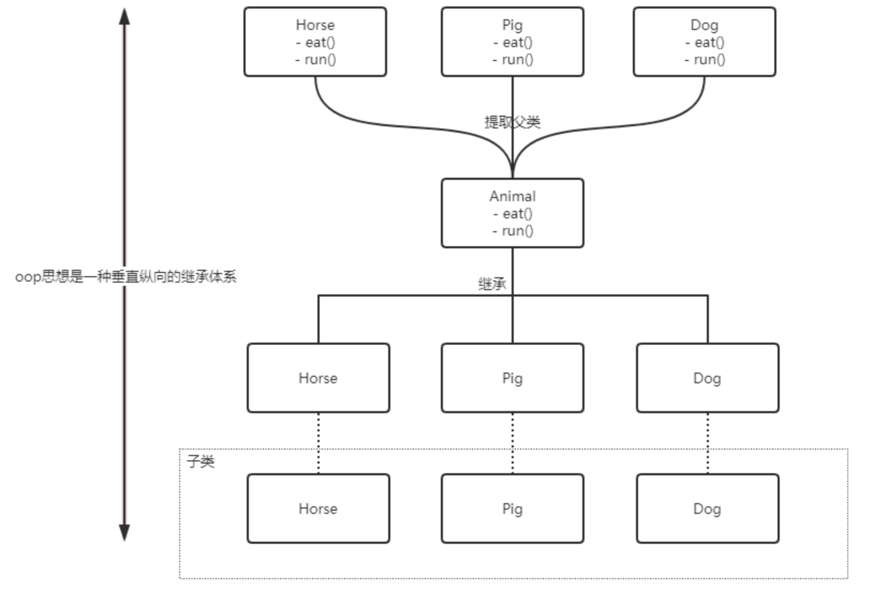

OOP 编程思想可以解决大部分的代码重复问题。但是有一些问题是处理不了的。比如在父类 Animal 中的多个方法的相同位置出现了重复的代码，OOP 就解决不了。

```java
/**
 * 动物父类
 */
public class Animal {

    /** 身高 */
    private String height;

    /** 体重 */
    private double weight;

    public void eat() {
        // 性能监控代码
        long start = System.currentTimeMillis();

        // 业务逻辑代码
        System.out.println("I can eat...");

        // 性能监控代码
        System.out.println("执行时长：" + (System.currentTimeMillis() - start)/1000f + "s");
    }

    public void run() {
        // 性能监控代码
        long start = System.currentTimeMillis();

        // 业务逻辑代码
        System.out.println("I can run...");

        // 性能监控代码
        System.out.println("执行时长：" + (System.currentTimeMillis() - start)/1000f + "s");
    }
}
```

这部分重复的代码，一般统称为 **横切逻辑代码**。

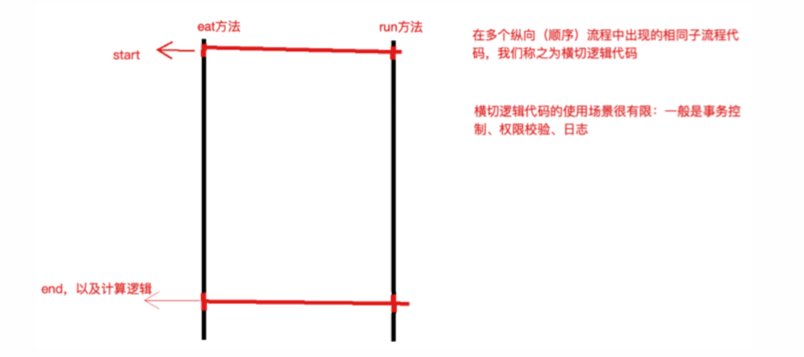

横切逻辑代码存在的问题：

- 代码重复问题
- 横切逻辑代码和业务代码混杂在一起，代码臃肿，不变维护

**AOP 就是用来解决这些问题的**

AOP 另辟蹊径，提出横向抽取机制，将横切逻辑代码和业务逻辑代码分离

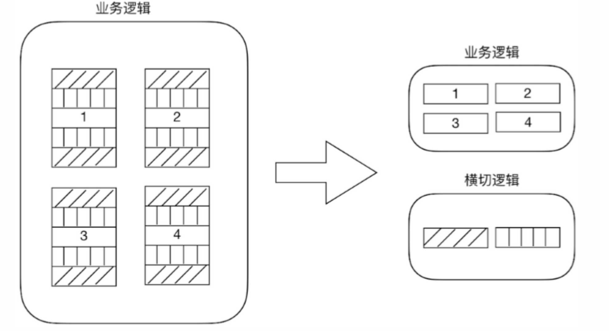

代码拆分比较容易，难的是如何在不改变原有业务逻辑的情况下，悄无声息的将横向逻辑代码应用到原有的业务逻辑中，达到和原来一样的效果。

## AOP作用

在不改变原有业务逻辑的情况下，增强横切逻辑代码，根本上解耦合，避免横切逻辑代码重复。

# bean的生命周期

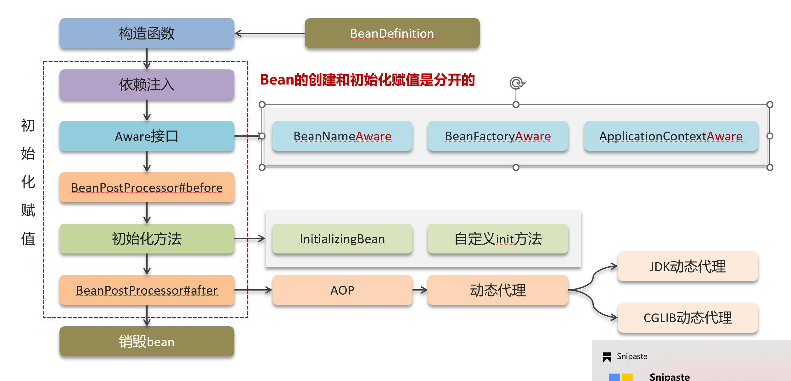

①通过BeanDefinition获取bean的定义信息

②调用构造函数实例化bean

③完成bean的依赖注入

④执行实现Aware接口的方法(BeanNameAware、BeanFactoryAware、ApplicationContextAware)

⑤Bean的后置处理器BeanPostProcessor的前置方法

⑥执行初始化方法(实现InitializingBean的init-method)

⑦Bean的后置处理器BeanPostProcessor的后置方法

⑧销毁bean


# 循环依赖

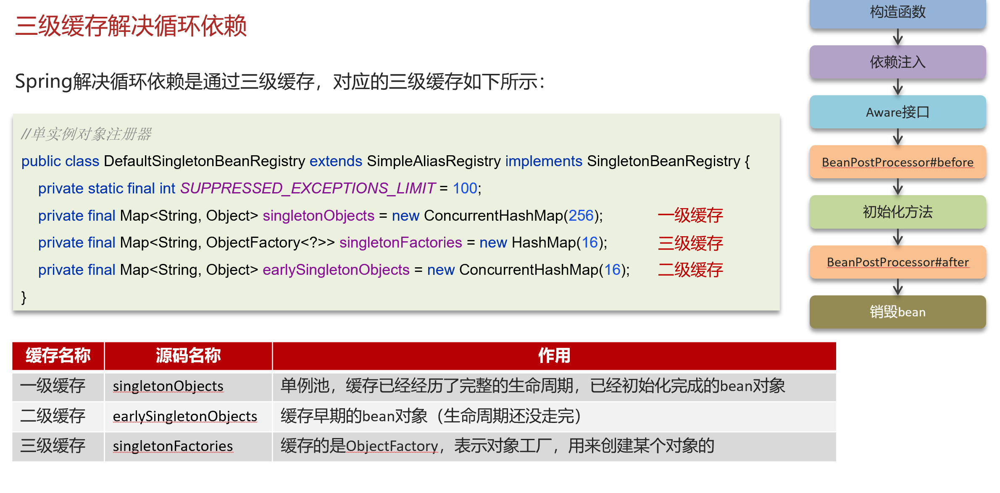

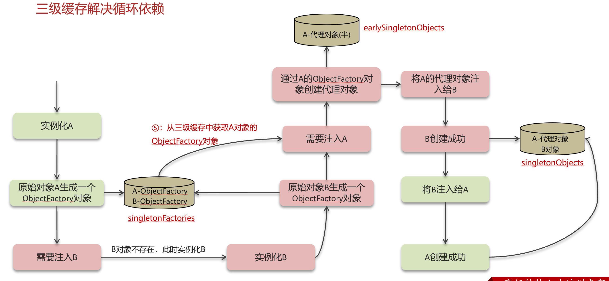

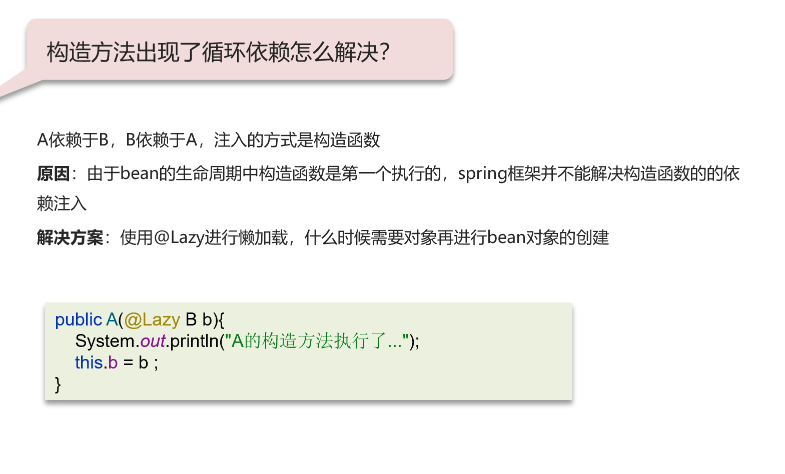

# 事务

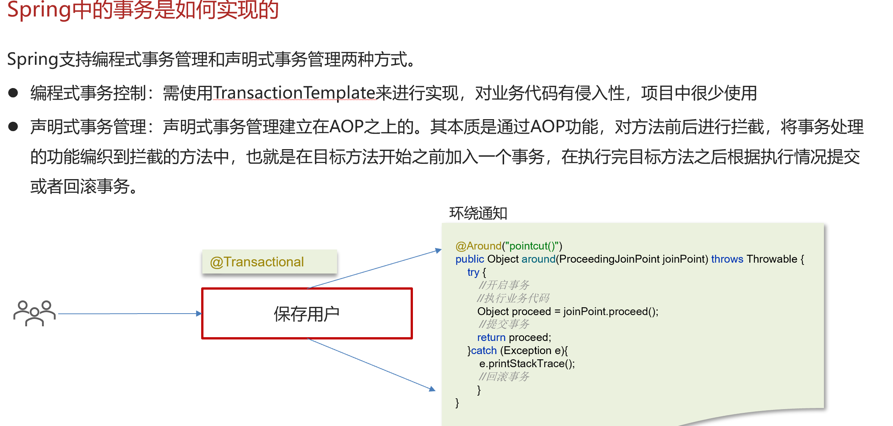

## 事务异常

①异常捕获处理，自己处理了异常，没有抛出。解决方法：手动抛出

②抛出检查异常。解决方法：配置rollbackFor属性为Exception

③非public方法导致的事务失效。解决方法：改为public

#  常见注解

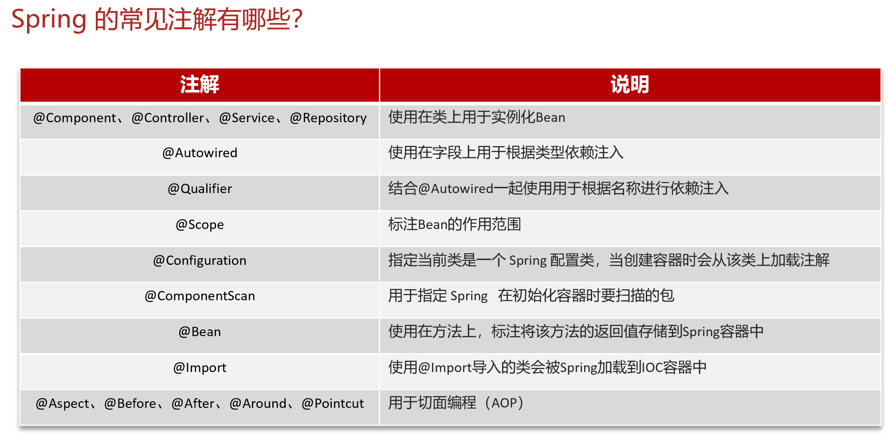


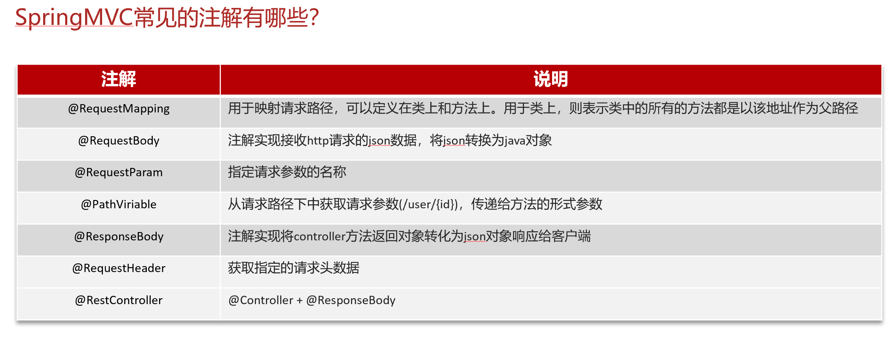

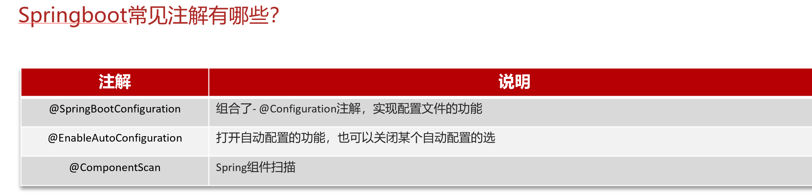

# SpringBoot自动配置

1.在Spring Boot项目中的引导类上有一个注解@SpringBootApplication，这个注解是对三个注解进行了封装，分别是：

* @SpringBootConfiguration

* @EnableAutoConfiguration

* @ComponentScan

2, 其中@EnableAutoConfiguration是实现自动化配置的核心注解。 该注解通过@Import注解导入对应的配置选择器。

​	内部就是读取了该项目和该项目引用的Jar包的的classpath路径下META-INF/spring.factories文件中的所配置的类的全类名。 	在这些配置类中所定义的Bean会根据条件注解所指定的条件来决定是否需要将其导入到Spring容器中。

3, 条件判断会有像@ConditionalOnClass这样的注解，判断是否有对应的class文件，如果有则加载该类，把这个配置类的所有的Bean放入spring容器中使用。